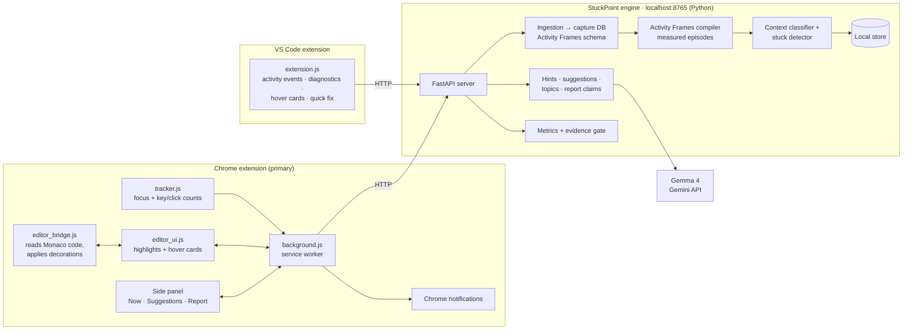

# StuckPoint

> A Chrome extension (with a VS Code companion) that notices when you're stuck while coding, gives help that depends on *where* you are, highlights slow parts of your code with a GitHub-style hover card showing a faster approach, and builds an evidence-backed skills report, all inside the extension and powered by Gemma 4.

## Team

**Team Name:** [Team Name]


| Member | Contribution   |
| ------ | -------------- |
| [Name] (Team Lead) | Local engine: FastAPI server, event ingestion into Activity Frames, stuck detection, store, metrics |
| [Name] | Gemma 4 layer: hints, no-code guard, code suggestions with quote verification, evidence gate, report |
| [Name] | Chrome extension: activity tracking, notifications, LeetCode highlights and hover cards |
| [Name] | Side panel dashboard, VS Code extension, README, demo and submission |


## Problem Statement

### The Problem

When students and developers get stuck on code, they usually fall into one of two bad outcomes:

1. **They struggle alone for too long.** They loop between the editor, errors, Stack Overflow and docs for 30–60 minutes without progress.
2. **They outsource the thinking.** They paste the problem into an AI chatbot, copy the solution and learn nothing. On practice platforms like LeetCode that defeats the purpose of practising; on assignments it's an academic-integrity problem.

Existing AI assistants make this worse. They live inside one editor, so they can't see that you've bounced between LeetCode, Google and ChatGPT for 25 minutes. They apply the same policy everywhere, solving a practice problem as readily as writing boilerplate. And when your code *works but is slow*, nobody shows you where, in the place you're actually writing it.

### Why We Chose This Problem

Every member of our team has lived both failure modes: the hour-long rabbit hole and the copy-pasted solution that taught us nothing. Coding practice is one of the most common activities for engineering students, so better help at the moment of being stuck, and honest feedback on *how* we code, directly affects learning and placement preparation.

A browser extension is the right place for it: it is where students practise (LeetCode, HackerRank), search (Stack Overflow, Google) and ask AI (ChatGPT). It works on every operating system without installing a separate app. A VS Code extension covers the projects they build.

## Solution

StuckPoint is a **Chrome extension** (primary) plus a **VS Code extension**, backed by a small local engine:

1. **Tracks coding activity across tools.** Which coding site or file you're on and how much you type: counts only, never the keys.
2. **Detects stuck moments**: long time on one problem, loops to help sites, low typing.
3. **Asks before helping:** a Chrome notification, "Stuck on *Coin Change*? Want a hint?", opens the side panel.
4. **Adapts help to context:**

   | Context | Examples | Help | Code suggestions |
   |---|---|---|---|
   | Practice | LeetCode, HackerRank, Codeforces | Hints only, 3 levels, never code | Highlight + explanation; faster code unlocks only after you mark the problem solved |
   | Project | VS Code, localhost, GitHub | Hint first; full fix on request | Highlight + hover card with faster code + Apply |
   | Exam | Proctored / assessment sites | Off | Off |

5. **Inline code suggestions.** Slow or clumsy lines are highlighted in the editor (LeetCode's Monaco editor in Chrome, or VS Code). Hovering shows a card like GitHub's hover cards: what's slow, why, complexity before → after, and the better approach.
6. **Skills report in the side panel.** Strengths, weak topics, time-to-unstuck and hints used, with every number verified against measured activity.

### Key Features

- **Chrome extension first:** works on Windows, macOS and Linux; the dashboard lives in Chrome's side panel, with no separate app to open.
- **VS Code extension:** suggestions as editor diagnostics, hover cards, and a one-click "⚡ Apply faster version" quick fix.
- **Cross-site stuck detection:** sees the loop between the problem, Stack Overflow, Google and ChatGPT, which an editor plugin alone cannot.
- **Context-aware help policy:** hints only on practice sites, full help on your own projects, off during exams.
- **Graduated hints:** nudge → concept → plain-English plan, so the learner does the solving.
- **Highlight + hover suggestions:** faster approaches shown where the code is, GitHub-style.
- **Verified AI output:** report numbers are recomputed from measured activity, and code suggestions must quote your real code or they are dropped.
- **Privacy by design:** keystroke *contents* are never recorded, only counts. The API key stays in the local engine, not in the extension.

## Innovation and Differentiation

| Conventional AI coding assistants | StuckPoint |
|---|---|
| Live inside one editor or one website | Chrome extension + VS Code extension sharing one engine and one view of your activity |
| Respond only when asked | Notice being stuck and *offer* help |
| Same policy everywhere; will solve practice problems | Policy depends on context: hints only where learning or integrity matters |
| Code review only on request, in a chat window | Highlights slow code in place, with a hover card, GitHub-style |
| Show the optimal solution immediately | On practice sites, the faster code unlocks only after you solve it yourself |
| LLM output is trusted as-is | **"Gemma proposes; code verifies."** Report numbers are recomputed from activity; suggestion line numbers are computed from exact quotes of your code, never taken from the model |

Our core technical idea is **verified inference**. [Activity Frames](https://github.com/nossa-y/activity-frames) separates *measured* facts from *inferred* interpretations, which must carry a confidence level and evidence. Our extensions record activity in Activity Frames' capture format; Activity Frames compiles it into measured episodes; Gemma 4 adds the inferred layer; and our deterministic checks verify Gemma's claims before anything reaches the user.

## Technical Implementation

### Architecture



### Technology Stack


| Category        | Technologies                |
| --------------- | --------------------------- |
| Frontend        | Chrome extension (Manifest V3, plain JavaScript, Side Panel API, Monaco editor decorations); VS Code extension (JavaScript, Diagnostics / Hover / Code Action APIs) |
| Backend         | Python 3.10+, FastAPI, Uvicorn (local engine on `127.0.0.1:8765`) |
| Database        | SQLite: capture database in Activity Frames' schema; local store for signals, hints, solved flags and report claims |
| AI / ML         | Gemma 4 (`gemma-4-31b-it`) via the Gemini API |
| Infrastructure  | Runs on the user's machine; model inference via Google's Gemini API |
| APIs / Services | Gemini API (`google-genai` SDK); Activity Frames Python API |


### How It Works

**1. Activity tracking (extensions).** The Chrome extension's content script sends a heartbeat every 10 seconds while a page is focused: page title and URL. It also sends counts of keystrokes and clicks. The VS Code extension sends the same for the active file. Key values are never captured.

**2. Ingestion into Activity Frames (engine).** The engine writes these events into a SQLite database using the tables Activity Frames reads (`frames` and `ui_events`). Keystroke counts are stored as placeholder characters, so counts are exact while no typed text is ever stored. Activity Frames then compiles the raw events into *frames*: bounded, measured episodes such as "leetcode.com, *Coin Change*, 20:12–20:20, 8.2 active minutes, 58 keystrokes", each with evidence pointers. Activity Frames' own recorder is macOS-only; our extensions make the same pipeline work on every OS.

**3. Context classification.** Each frame is labelled practice, project, exam or other from its site and window title. LeetCode problem names come from the page title, e.g. `322. Coin Change - LeetCode` → `leetcode:coin-change`.

**4. Stuck detection.** A background loop checks the last 30 minutes against three deterministic rules:
- **Time:** long time on one problem.
- **Loops:** repeated problem → help site → problem cycles.
- **Low input:** a low typing rate.

When rules agree, the signal is confirmed; borderline cases go to Gemma 4. The extension polls the engine and shows a Chrome notification.

**5. Hints.** In the side panel, each request reveals one more level (nudge → concept → plan). On practice sites the prompt forbids code, and a guard blocks anything code-like and regenerates. Code is never shown, even if the user asks.

**6. Code suggestions.** When typing pauses (or on demand), the extension reads the code from the editor and the engine asks Gemma 4 for up to three improvements. Each must include an **exact quote** of the user's code. The engine finds that quote, **computes the line numbers itself**, and drops any suggestion whose quote doesn't exist. The extension then highlights those lines:
- **Chrome / LeetCode:** Monaco editor decorations, with a hover card and a ⚡ gutter marker.
- **VS Code:** Information diagnostics, a hover card, and an "Apply faster version" quick fix.

On practice sites the replacement code is withheld until the problem is marked solved.

**7. Skills report.** Activity is grouped into per-problem sessions; Gemma 4 tags topics and drafts claims (strengths, weaknesses, recommendations). The **evidence gate** recomputes every number from the measured metrics and checks every cited problem exists. Claims are marked verified, low-confidence or rejected, with the reason shown in the side panel.

### Technical Decisions

- **Extensions as the recorder.** Writing events in Activity Frames' capture schema keeps its deterministic, evidence-linked compiler and makes it cross-platform.
- **Local engine between extensions and Gemma.** One shared brain for Chrome and VS Code, reusing the same Python detection and Gemma code, and keeping the API key out of client-side extension code.
- **Deterministic first, LLM second.** Stuck detection, line ranges and report numbers are computed by code. Gemma 4 is used only where judgement or language is needed.
- **Never trust model line numbers.** Suggestions are anchored by exact quotes; unmatched quotes are discarded.
- **Monaco's native decorations for highlights.** LeetCode uses the Monaco editor (the VS Code editor), so its built-in decoration hover messages give a native-feeling hover card. A DOM-overlay fallback exists if Monaco isn't reachable.
- **Earned answers on practice sites.** Faster code is withheld until the user marks the problem solved, so suggestions teach rather than replace practice.
- **Counts, not content.** Typing is measured as counts only; the engine stores no typed text.

## Implementation During the Hackathon

> _To be updated during the Hack Day. Tick only what actually works._

- [x] Context classifier (practice / project / exam) and stuck detector with tests
- [x] Gemma 4 client with JSON validation, retries, caching and logging
- [x] Graduated hints with the no-code guard; borderline stuck judgement; topic tagging; report-claim drafting
- [ ] Local engine: FastAPI server, ingestion into Activity Frames, background detection loop
- [ ] Chrome extension: tracking, notifications, side panel
- [ ] LeetCode highlights + hover cards
- [ ] Code suggestions with quote verification and practice-mode policy
- [ ] Evidence gate + skills report in the side panel
- [ ] VS Code extension: diagnostics, hover cards, quick fix

### Team Contributions

- **[Member Name]:** Local engine, ingestion into Activity Frames, stuck detection, store, metrics
- **[Member Name]:** Gemma 4 integration, hints and guard, code suggestions, evidence gate, report
- **[Member Name]:** Chrome extension core: tracking, notifications, LeetCode highlights and hover cards
- **[Member Name]:** Side panel dashboard, VS Code extension, README, demo video, submission

## Working Application

**Live Application:** [Live URL]

StuckPoint is a browser extension plus a local engine, so it runs on the user's machine rather than as a hosted website. Judges can install it in a few minutes by following [Setup and Usage](#setup-and-usage): start the engine, then load the unpacked extension in Chrome. [Add a link to a release zip of the extension here if one is published.]

## Demo Video

**Demo Video:** [Video URL]

The demo covers:

1. On LeetCode, a user gets stuck on *Coin Change*, bouncing to Stack Overflow and ChatGPT; a Chrome notification offers help.
2. The side panel gives graduated hints and refuses to show code, even when asked.
3. On *Two Sum*, a working nested-loop solution gets highlighted; the hover card explains the O(n²) → O(n) improvement. After marking it solved, the card shows the faster code.
4. In VS Code, a slow pattern in a project file is highlighted; hover shows the suggestion, and the quick fix applies it.
5. The side-panel report shows verified, low-confidence and rejected claims, with reasons.

## Open Source and AI Usage

### AI / Models

- **Gemma 4 (`gemma-4-31b-it`, via the Gemini API):**
  - Judges borderline stuck patterns.
  - Writes graduated, code-free hints on practice sites, and full fixes on personal projects.
  - Finds slower-than-necessary code and proposes faster approaches (anchored by exact quotes and verified by the engine).
  - Tags problems with skill topics.
  - Drafts the skills report as structured JSON, which the evidence gate verifies.

  [Update if the `gemma-4-26b-a4b-it` fallback was used.]

### Open Source Components

- **[Activity Frames](https://github.com/nossa-y/activity-frames) (MIT):** Compiles the extensions' raw activity events into deterministic, evidence-linked episodes. Its schema and two-tier measured/inferred specification are the foundation of our data model.
- **[FastAPI](https://github.com/fastapi/fastapi) (MIT) + [Uvicorn](https://github.com/encode/uvicorn) (BSD):** Local engine HTTP server.
- **[google-genai](https://github.com/googleapis/python-genai) (Apache 2.0):** Python SDK for calling Gemma 4 through the Gemini API.
- **[jsonschema](https://github.com/python-jsonschema/jsonschema) (MIT):** Validates every Gemma 4 response.
- **Monaco editor APIs** (as embedded by LeetCode; Monaco is MIT): used at runtime to read code and add highlight decorations. Not bundled.
- **Dataset:** N/A. All data comes from the user's own activity; demo data was recorded by team members during the Hack Day.
- **API / Service:** Gemini API (Google AI Studio), hosted inference for Gemma 4.

## Setup and Usage

> _Verify these steps on a clean machine before submitting._

### Prerequisites

- Google Chrome (or another Chromium browser with Side Panel support)
- Python 3.10 or newer
- A Gemini API key from [Google AI Studio](https://aistudio.google.com/apikey)
- Optional: VS Code 1.80+ for the IDE extension

### Installation

```bash
git clone [repository-url]
cd stuckpoint
python -m venv .venv
source .venv/bin/activate        # Windows: .venv\Scripts\activate
pip install -r requirements.txt
cp .env.example .env             # then add your GEMINI_API_KEY
```

**Chrome extension:** open `chrome://extensions`, enable **Developer mode**, click **Load unpacked**, and select `extensions/chrome`.

**VS Code extension:** open the `extensions/vscode` folder in VS Code and press **F5** to launch it in an Extension Development Host window.

### Environment Variables

```env
GEMINI_API_KEY=your-key-here
GEMMA_MODEL=gemma-4-31b-it
STUCKPOINT_SOURCE=live
AFRAMES_DB=data/capture.sqlite
ENGINE_PORT=8765
# Minutes on one problem before StuckPoint offers help (3 for a quick demo)
STUCK_THRESHOLD_MIN=15
```

### Running the Project

```bash
# Start the local engine (keep it running)
python -m stuckpoint serve
```

Then use Chrome (and VS Code) normally. Useful extra commands:

```bash
python -m stuckpoint check-llm   # verify the Gemma 4 connection
python -m stuckpoint demo        # run detection on sample data (no extension needed)
python -m pytest                 # run the tests
```

### Usage

1. Start the engine, then click the StuckPoint icon in Chrome to open the side panel.
2. Code as usual on LeetCode, or in VS Code. The side panel's **Now** tab shows the detected context (Practice / Project / Exam).
3. When you're stuck, a notification offers help. Open it for graduated hints: **Next hint** reveals more; **Solved ✓** marks the problem done.
4. Slow code gets highlighted. **Hover** over the highlight for the suggestion card. On practice sites the faster code appears after you mark the problem solved; in VS Code, use **⚡ Apply faster version** from the quick-fix menu.
5. Open the **Report** tab and click **Refresh** for your skills report. Click **Show evidence** on any claim to see what it's based on.

## Devpost Submission

**Devpost Project:** [Devpost Project URL]

[Add the link to the team's Devpost submission. Ensure the Devpost project page is complete and contains the required project information, links, media, and team details.]

## Challenges and Learnings

> _To be completed after the Hack Day._

- **Challenges:** [e.g. Activity Frames' recorder being macOS-only (solved by making the extensions the recorder), reaching LeetCode's Monaco editor from an extension, MV3 service-worker lifecycles, keeping hints from leaking code, anchoring model suggestions to real lines]
- **Learnings:** [What the team learned technically and about the problem]

## Credits and License

### Credits

- [Activity Frames](https://github.com/nossa-y/activity-frames) by Nossa Iyamu: episodic activity compilation (MIT)
- [Gemma 4](https://ai.google.dev/gemma) by Google: open-weight language model, used via the [Gemini API](https://ai.google.dev)
- [FastAPI](https://fastapi.tiangolo.com), [Uvicorn](https://www.uvicorn.org), [google-genai](https://github.com/googleapis/python-genai), [jsonschema](https://python-jsonschema.readthedocs.io)
- [Monaco Editor](https://github.com/microsoft/monaco-editor) (MIT), accessed at runtime on LeetCode
- Built at Hacktoberfest Hack Day Coimbatore 2026, hosted by INIT Club & iDEA Club, Amrita Vishwa Vidyapeetham, powered by MLH

### License

This project is licensed under the [MIT License](LICENSE).

## Submission Checklist

- [ ] Project title and description added
- [ ] All team members listed
- [ ] Problem clearly explained
- [ ] Reason for choosing the problem explained
- [ ] Solution and key features documented
- [ ] Innovation and differentiation explained
- [ ] Architecture included
- [ ] Technical implementation documented
- [ ] Work completed during the hackathon documented
- [ ] Team contributions documented
- [ ] Working application is functional
- [ ] Live application link added where applicable
- [ ] Demo video added
- [ ] AI and open-source components documented
- [ ] Setup and usage instructions tested
- [ ] Challenges and learnings documented
- [ ] Devpost submission completed
- [ ] Devpost link added
- [ ] Credits added
- [ ] License added
- [ ] Repository is organized and complete
