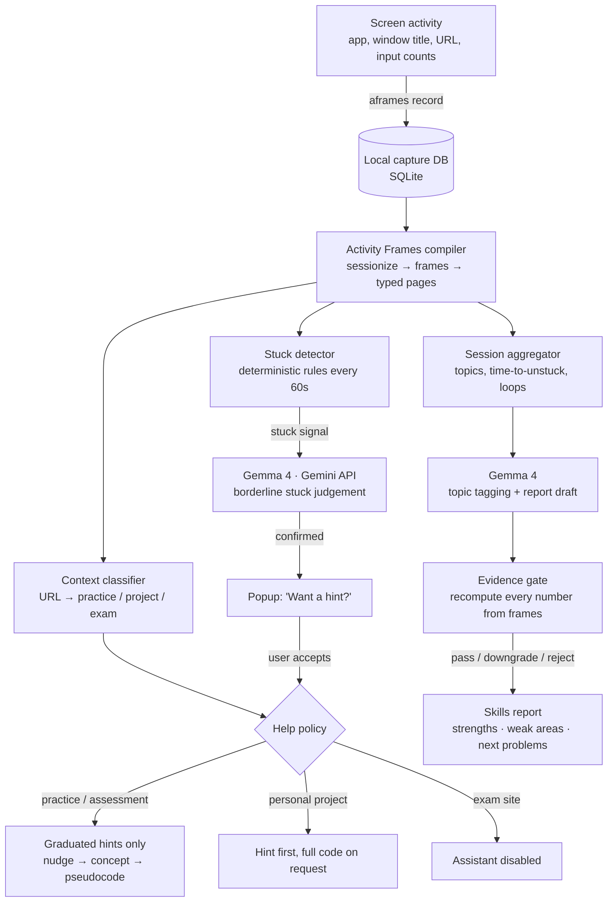

# StuckPoint

> A privacy-first coding companion that works across every coding platform: it notices when a student or developer is stuck, offers hints or full help depending on *where* they are, never hands out code on practice and assessment sites, and builds an evidence-backed report of their strengths and weak spots — powered by Activity Frames and Gemma 4.

## Team

**Team Name:** [Team Name]


| Member | Contribution   |
| ------ | -------------- |
| [Name] (Team Lead) | Capture pipeline, Activity Frames integration, stuck detector |
| [Name] | Gemma 4 integration: prompts, JSON schemas, hint escalation |
| [Name] | Context policy engine, evidence gate, skills report |
| [Name] | Desktop popup / web dashboard, README, demo |


## Problem Statement

### The Problem

When students and developers get stuck on code, they usually fall into one of two bad outcomes:

1. **They struggle alone for too long.** They loop between the editor, error messages, Stack Overflow and documentation for 30–60 minutes without progress, get frustrated, and often give up.
2. **They outsource the thinking.** They paste the problem into an AI chatbot, copy the full solution, and move on having learned nothing. On practice platforms like LeetCode or HackerRank this defeats the entire purpose of practising; on course assignments it becomes an academic-integrity problem.

Existing AI coding assistants make this worse in two ways. They live inside one editor, so they cannot see that you've spent 25 minutes bouncing between LeetCode, a search engine and an AI chat. And they apply the same policy everywhere: they will write the full solution to a practice problem just as readily as boilerplate for a personal project.

Instructors and learners also lack an honest picture of progress. Self-assessment ("I'm okay at DP") is unreliable, and platforms only record final submissions, not the process of getting there.

### Why We Chose This Problem

Every member of our team has lived both failure modes — the hour-long rabbit hole and the copy-pasted solution that taught us nothing. Coding practice is one of the most common activities for engineering students, so better help at the moment of being stuck has a direct effect on learning, placement preparation and confidence.

We also saw a technical opening. [Activity Frames](https://github.com/nossa-y/activity-frames) compiles screen activity into structured, evidence-linked episodes that work across *any* application. That makes it possible to detect being stuck from behaviour, platform-independently, without writing a plugin for every editor and website. Because capture and compilation happen on the device, the model only ever needs a short text summary of what happened, never the student's screen.

## Solution

StuckPoint runs quietly on the user's machine and does four things:

1. **Detects when you're stuck.** It turns raw screen activity into episodes using Activity Frames, then flags stuck patterns: long time on one problem with little progress, repeated editor → error → search loops, or repeated submissions to the same problem.
2. **Asks before helping.** A small popup asks: *"Looks like you've been on Coin Change for 22 minutes — want a hint?"* It never interrupts with unrequested answers.
3. **Adapts help to context.** On practice and assessment platforms it gives graduated hints only (nudge → concept → pseudocode) and never generates code. On your own projects it offers a hint first and full code if you ask. On exam/proctored sites it switches itself off.
4. **Builds a skills report.** Over time it produces a report of where you are strong, where you need to improve, and what to practise next. Every claim is backed by measured evidence from your sessions.

Screen capture and episode compilation run locally. Gemma 4 is called through the Gemini API with compact text summaries only.

### Key Features

- **Cross-platform stuck detection** — works across VS Code, browsers, LeetCode, HackerRank, Codeforces, Colab and more, because it observes activity rather than integrating with each tool.
- **Context-aware help policy** — hint-only on practice and assessment sites, full assistance on personal projects, disabled on exam sites.
- **Graduated hint escalation** — each request reveals a little more (nudge → key concept → pseudocode), so the learner does the solving.
- **Evidence-backed skills report** — strengths, weak topics, average time-to-unstuck per topic and recommended next problems, each linked to the sessions it came from.
- **Evidence gate** — every number Gemma 4 states in the report is recomputed from measured data before it is shown; unsupported claims are rejected or downgraded.
- **Privacy by design** — screen capture and the activity database stay on the machine. Gemma 4 receives only short text summaries (problem title, window titles, time and input counts) plus any code the user explicitly pastes. Never screenshots.

## Innovation and Differentiation

| Conventional AI coding assistants | StuckPoint |
|---|---|
| Live inside one editor or website | Work across every coding platform from behaviour on screen |
| Respond only when asked | Notice being stuck and *offer* help |
| Same policy everywhere — will solve practice problems | Policy depends on context: hints only where learning or integrity matters |
| Give the full answer in one step | Escalate hints step by step |
| No longitudinal view of the learner | Builds a skills profile over weeks of real practice |
| LLM claims about the user are unchecked | Every report claim is verified against measured activity |
| Often send code or screen content to the cloud | Capture stays local; the open-weight model sees only minimal text summaries |

Our core technical idea is **evidence-gated inference**. Activity Frames separates *measured* facts (what app, which page, how long, how much input) from *inferred* interpretations, which must carry a confidence level and evidence. Activity Frames itself only produces the measured tier. StuckPoint adds the inferred tier using Gemma 4, and builds a deterministic checker that recomputes every number Gemma cites from the measured frames before anything reaches the user. In short: **Gemma can propose; only the measured data can prove.**

## Technical Implementation

### Architecture



### Technology Stack


| Category        | Technologies                |
| --------------- | --------------------------- |
| Frontend        | [Streamlit dashboard for the report; desktop notification/popup — finalize during build] |
| Backend         | Python 3.10+ |
| Database        | SQLite (local capture database managed by Activity Frames' recorder); JSON files for sessions and reports |
| AI / ML         | Gemma 4 (`gemma-4-31b-it`, instruction-tuned) |
| Infrastructure  | Runs on the user's machine; model inference via Google's Gemini API |
| APIs / Services | Gemini API (`google-genai` SDK) for Gemma 4; Activity Frames Python API and CLI |


### How It Works

**1. Capture.** Activity Frames' recorder (`aframes record`) captures screen activity locally: which app is focused, window titles, browser URLs, and counts of keystrokes, clicks and copies. Audio is off and typed text is not used.

**2. Episode compilation.** Activity Frames compiles thousands of raw snapshots into *frames*: bounded episodes such as "Chrome, leetcode.com, 20:10–20:32, 22 active minutes, 180 keystrokes." Each frame has typed page references and evidence pointers to the raw rows. This step is fully deterministic; no AI is involved.

**3. Context classification.** A rule table maps each frame's site to a context:
- **Practice / assessment:** LeetCode, HackerRank, Codeforces, course portals.
- **Personal project:** a local repo, localhost, GitHub.
- **Exam:** known proctored domains.

For LeetCode, a small parser extracts the problem slug from `leetcode.com/problems/<slug>`.

**4. Stuck detection.** Every minute, the detector compiles the last 30–60 minutes of frames and checks deterministic rules:
- Time on one problem exceeds a threshold with low input.
- Repeated loops between editor, run/error page, search and AI chat.
- Repeated reloads of the same submission page.

Borderline cases go to Gemma 4, which judges whether the pattern looks like productive exploration or genuine stuckness.

**5. Asking and helping.** If the user is stuck, a popup offers help. On acceptance, the policy engine decides what is allowed, and Gemma 4 generates the next hint level. In practice/assessment contexts the prompt and a post-check both forbid code output. In project mode the user can paste their code or error and request a full solution.

**6. Skills report.** Sessions are aggregated per problem and topic: time to solve, number of stuck episodes, hints used, time-to-unstuck. Gemma 4 tags each problem or error with a skill topic (e.g. dynamic programming, graphs, recursion, async, CORS) and drafts the report. The **evidence gate** recomputes every figure Gemma cites from the measured data. Claims that don't match are rejected; claims that depend on time when nothing was being captured are downgraded.

### Technical Decisions

- **Behaviour-based detection instead of editor plugins.** Observing activity via Activity Frames lets one system work across every platform. Per-platform plugins would cover only a few tools in a hack day.
- **Deterministic first, LLM second.** Stuck detection starts with transparent rules over measured frames. Gemma 4 is used only where judgement is needed: borderline stuck cases, hint writing, topic tagging and report drafting. This keeps behaviour predictable and fast.
- **Measured vs inferred separation.** We follow Activity Frames' two-tier specification. All model output lives under an `inferred` namespace with a confidence level and evidence, so the measured record can always be inspected on its own.
- **Evidence gate for the report.** A report that tells someone "you're weak at DP" must be trustworthy. Recomputing every number from the measured tier prevents hallucinated statistics.
- **Minimal data to the model.** Capture and compilation stay on the device, and Gemma 4 receives only compact text summaries, never screenshots or the capture database. We use Gemma 4 through the Gemini API so it runs on any laptop without a GPU; because Gemma is open-weight, the same prompts can run fully offline on a local runtime in future.
- **Ask, don't interrupt.** Help is offered, never forced. Users can dismiss or snooze the popup.
- **Hard no-code rule on practice/assessment sites.** This is enforced twice: in the prompt and by a post-generation check that blocks code blocks in hint mode.

## Implementation During the Hackathon

> _To be updated during the Hack Day. Mark each item when it's done and add what was actually built._

- [ ] Activity Frames capture and compilation running on the demo machine
- [ ] LeetCode problem parser and context classifier
- [ ] Deterministic stuck detector with configurable thresholds
- [ ] Gemma 4 integration via the Gemini API with validated JSON output
- [ ] Graduated hint escalation with the no-code check
- [ ] Help popup (accept / dismiss / snooze)
- [ ] Session aggregation and topic tagging
- [ ] Evidence gate for report claims
- [ ] Skills report dashboard
- [ ] Project-mode full-code assistance (stretch)

### Team Contributions

- **[Member Name]:** Capture pipeline, Activity Frames integration, context classifier, stuck detector
- **[Member Name]:** Gemma 4 prompts and schemas, hint escalation, no-code post-check
- **[Member Name]:** Session aggregation, evidence gate, skills-report logic, tests
- **[Member Name]:** Popup and dashboard UI, README, demo video, presentation

## Working Application

**Live Application:** [Live URL]

StuckPoint observes the local screen, so it is designed to run on the user's own machine rather than as a hosted web app. Judges can test it by following [Setup and Usage](#setup-and-usage). [If a hosted read-only dashboard of the demo report is deployed, add its link here and describe what can be explored.]

## Demo Video

**Demo Video:** [Video URL]

The demo covers:

1. A user working on a LeetCode problem gets stuck; after a few minutes StuckPoint offers a hint.
2. The user asks for the full solution; StuckPoint declines and escalates to the next hint level instead.
3. The user switches to a personal project; the same tool now offers full code on request.
4. The skills report built from the team's sessions during the Hack Day, showing strong topics, weak topics and the evidence behind each claim.

## Open Source and AI Usage

### AI / Models

- **Gemma 4 (`gemma-4-31b-it`, via the Gemini API):** Judges borderline stuck patterns; generates graduated, code-free hints in practice mode; generates code assistance in project mode; tags problems and errors with skill topics; drafts the skills report as structured JSON, which is then verified by the evidence gate. [Update if the `gemma-4-26b-a4b-it` fallback was used.]

### Open Source Components

- **[Activity Frames](https://github.com/nossa-y/activity-frames) (MIT):** Local screen-activity capture management and deterministic compilation of activity into evidence-linked episodes; used as a dependency via `pip install activity-frames`. Its schema and two-tier measured/inferred specification are the foundation of our data model.
- **[screenpipe](https://github.com/mediar-ai/screenpipe) (MIT):** Capture engine provisioned and managed by Activity Frames' `aframes record`.
- **[google-genai](https://github.com/googleapis/python-genai) (Apache 2.0):** Python SDK for calling Gemma 4 through the Gemini API.
- **[Streamlit](https://github.com/streamlit/streamlit) (Apache 2.0):** Skills-report dashboard. [Update if a different UI framework is used.]
- **Dataset:** N/A — all data is generated by the user's own activity. Demo data was recorded by team members during the Hack Day.
- **API / Service:** Gemini API (Google AI Studio) — hosted inference for Gemma 4.

Gemma 4 is used under its published license terms. Activity Frames and screenpipe are used under the MIT license; their copyright notices are preserved in their packages.

## Setup and Usage

> _Commands below reflect the planned repository layout. Verify and update them once the build is complete._

### Prerequisites

- macOS (Apple Silicon recommended — Activity Frames' capture engine is best tested there; Linux x64 is supported but less tested)
- Python 3.10 or newer
- A Gemini API key from [Google AI Studio](https://aistudio.google.com/apikey)
- Internet connection (for Gemma 4 calls)
- Screen-recording and accessibility permissions granted to the capture engine when prompted

### Installation

```bash
git clone [repository-url]
cd stuckpoint
python -m venv .venv
source .venv/bin/activate
pip install -r requirements.txt
cp .env.example .env   # then add your GEMINI_API_KEY
```

### Environment Variables

```env
GEMINI_API_KEY=your-key-here
GEMMA_MODEL=gemma-4-31b-it
# Optional: point to an existing capture database instead of recording
AFRAMES_DB=
# Minutes on one problem before a stuck check runs
STUCK_THRESHOLD_MIN=15
# How often the detector runs, in seconds
CHECK_INTERVAL_S=60
```

### Running the Project

```bash
# 1. Start local activity capture
aframes record

# 2. Start the StuckPoint watcher (stuck detection + help popup)
python -m stuckpoint watch

# 3. Open the skills report dashboard
streamlit run stuckpoint/dashboard.py
```

To stop capture: `aframes record --stop`.

### Usage

1. Start capture and the watcher, then code as you normally would on any platform.
2. When StuckPoint detects you're stuck, a popup asks if you want help. Accept, dismiss or snooze it.
3. **On practice or assessment sites** (e.g. LeetCode), each "next hint" reveals a little more: nudge → concept → pseudocode. Code is never generated.
4. **On personal projects**, ask for a hint, or paste your code/error and request full code.
5. Open the dashboard to see your skills report: strong topics, topics to improve, time-to-unstuck trends and recommended next problems. Click any claim to see the sessions that support it.

## Devpost Submission

**Devpost Project:** [Devpost Project URL]

[Add the link to the team's Devpost submission. Ensure the Devpost project page is complete and contains the required project information, links, media, and team details.]

## Challenges and Learnings

> _To be completed after the Hack Day._

- **Challenges:** [e.g. platform support for capture, defining "stuck" reliably, keeping hints from leaking code, API latency and rate limits]
- **Learnings:** [What the team learned technically and about the problem]

## Credits and License

### Credits

- [Activity Frames](https://github.com/nossa-y/activity-frames) by Nossa Iyamu — episodic activity capture and compilation (MIT)
- [screenpipe](https://github.com/mediar-ai/screenpipe) — capture engine (MIT)
- [Gemma 4](https://ai.google.dev/gemma) by Google — open-weight language model
- [Gemini API / Google AI Studio](https://ai.google.dev) — hosted Gemma 4 inference
- [Streamlit](https://streamlit.io) — dashboard framework (Apache 2.0)
- Built at Hacktoberfest Hack Day Coimbatore 2026, hosted by INIT Club & iDEA Club, Amrita Vishwa Vidyapeetham, powered by MLH

### License

This project is licensed under the [MIT License](LICENSE).

## Submission Checklist

- [ ] Project title and description added
- [ ] All team members listed
- [ ] Problem clearly explained
- [ ] Reason for choosing the problem explained
- [ ] Solution and key features documented
- [ ] Innovation and differentiation explained
- [ ] Architecture included
- [ ] Technical implementation documented
- [ ] Work completed during the hackathon documented
- [ ] Team contributions documented
- [ ] Working application is functional
- [ ] Live application link added where applicable
- [ ] Demo video added
- [ ] AI and open-source components documented
- [ ] Setup and usage instructions tested
- [ ] Challenges and learnings documented
- [ ] Devpost submission completed
- [ ] Devpost link added
- [ ] Credits added
- [ ] License added
- [ ] Repository is organized and complete
