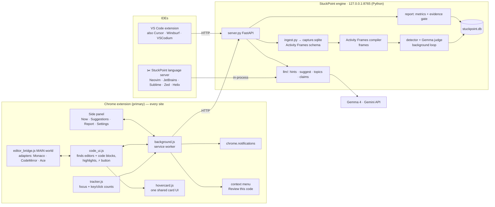

# StuckPoint — Team Build Instructions (v2: Chrome extension first)

> **⏰ Hard deadline: submission closes at 3:30 PM sharp. Restart at 12:50 PM with this plan. Our own target: submit by 3:15 PM.**
>
> **What changed in v2:** StuckPoint is now a **Chrome extension (primary)** plus a **VS Code extension**, with the dashboard *inside* the Chrome side panel. A new feature, **inline code suggestions**, highlights slow parts of code and shows a GitHub-style hover card with a faster approach. Everything already built (detector, Gemma layer, no-code guard, tests) is **kept**. The extensions now *feed* it.
>
> **v2.1 (1:05 PM):** hover suggestions are **universal**, for **students and working professionals**.
> - **Any website:** live editors on any site (Monaco, CodeMirror, Ace) and read-only code blocks (GitHub, Stack Overflow, docs, AI chat answers).
> - **Any IDE:** VS Code and its forks (Cursor, Windsurf, VSCodium), plus a ✂️-optional language server for every other editor.
> - **New profile setting:** Student (learner mode) or Professional.
>
> Skim Part 1 (5 minutes), then work from your own section in Part 4. **Part 3 (the HTTP API) is the contract between Python and JavaScript. Code to it exactly.** Anything marked ✂️ is cut unless you're ahead.

---

## Contents

1. [Project overview](#part-1--project-overview)
2. [Architecture](#part-2--architecture)
3. [Contracts: data models + HTTP API](#part-3--contracts)
4. [Individual instructions](#part-4--individual-instructions)
   - [Person 1 — Local engine: server, ingestion, detection, store](#person-1--local-engine-server-ingestion-detection-store)
   - [Person 2 — Gemma 4: hints, code suggestions, report + gate](#person-2--gemma-4-hints-code-suggestions-report--gate)
   - [Person 3 — Chrome extension: tracking, universal highlights & hover cards](#person-3--chrome-extension-tracking-universal-highlights--hover-cards)
   - [Person 4 — Side panel dashboard, VS Code extension, README & submission](#person-4--side-panel-dashboard-vs-code-extension-readme--submission)
5. [Timeline (12:50 → 3:30)](#part-5--timeline-1250--330)
6. [Git workflow and hackathon rules](#part-6--git-workflow-and-hackathon-rules)
7. [Demo script](#part-7--demo-script)
8. [Risks and fallbacks](#part-8--risks-and-fallbacks)

---

## Part 1 — Project overview

### One line

**StuckPoint** is a Chrome extension (plus IDE extensions) for students and working professionals. It notices when you're stuck while coding and gives help that depends on *where* you are. On **any website or IDE**, it highlights slow or clumsy code with a GitHub-style hover card showing a faster approach. It also builds an evidence-backed skills report. Everything lives in the extension's side panel, powered by Gemma 4.

### The problem

When students and developers get stuck they either struggle alone for too long, or paste the problem into an AI chatbot and learn nothing. Existing assistants live inside one editor, can't see that you've bounced between LeetCode, Stack Overflow and ChatGPT for 25 minutes, and will happily solve your practice problem for you. Nobody shows you *where* your working code is slow, in the place you're actually writing it.

### What StuckPoint does

1. **Tracks coding activity across tools.** The Chrome extension records which coding site and page you're on, and how much you type (counts only, never the keys). The VS Code extension does the same for your editor.
2. **Detects stuck moments** from that activity: long time on one problem, loops to help sites, low typing.
3. **Asks before helping:** a Chrome notification, "Stuck on *Coin Change*? Want a hint?", opens the side panel.
4. **Adapts help to context:**

   | Context | Examples | Help | Code suggestions |
   |---|---|---|---|
   | `practice` | LeetCode, HackerRank, Codeforces | Hints only, 3 levels, **never code** | Highlight + explanation; the faster *code* is shown **only after you mark the problem solved** |
   | `project` | VS Code / any IDE, online editors (CodeSandbox, Replit, StackBlitz, Colab), localhost | Hint first; full fix on request | Highlight + hover card with faster code + **Apply** |
   | `review` | Read-only code on GitHub, Stack Overflow, docs, blogs, ChatGPT answers | — | Highlight + hover card with faster code + **Copy** |
   | `exam` | Proctored / assessment sites | Off | Off |

   **Profile setting (side panel / VS Code settings):**
   - **Professional (default):** the table above.
   - **Student (learner mode):** in `project` mode too, faster code is withheld until you click **Solved** or **Show me**. Explanations always show.

5. **Universal inline code suggestions.** Slow or clumsy lines are highlighted wherever code appears, e.g. a nested loop that could be a hash-map lookup, or `x in list` inside a loop. Hovering shows the same card everywhere: what's slow, why, complexity before → after, and the better approach.
   - **Live editors on any site:** suggestions update when typing pauses.
   - **Read-only code blocks:** a small ⚡ button appears on hover; click it, or right-click → **"StuckPoint: Review this code"**. Nothing is sent until you ask, so pages you merely read never leave the browser.
6. **Skills report in the side panel:** strengths, weak topics, time-to-unstuck, hints used. Every number is verified by our **evidence gate** before it is shown.

### Why this wins (say this in the pitch)

- **Lives where you code:** any website in Chrome, VS Code and its forks, and (via a language server) any LSP editor. Works on any OS, with no separate app.
- **For learners and professionals:** the same hover card teaches a student and speeds up a developer; the profile and site decide whether code is shown.
- **Context-aware policy:** the same assistant behaves differently on LeetCode, in your own project, and in an exam.
- **Verified AI, everywhere:** *"Gemma proposes; code verifies."* Report numbers are recomputed from measured activity, and every code suggestion must quote real lines from your code or it's dropped.
- **Privacy:** only counts, titles and the code you're looking at go to the engine. Keystroke *contents* are never recorded.

### What each technology contributes

| Component | Its job |
|---|---|
| **Chrome + IDE extensions** (ours) | Recorder (focus, title, URL, key/click counts); UI: notifications, side panel, highlights and hover cards on any site; IDE diagnostics/hover/quick fix |
| **Activity Frames** (library, MIT) | Compiles the extensions' raw events (written in its capture-database schema) into measured episodes ("frames"). This makes it work on Windows, Linux and macOS, because its own recorder is macOS-only |
| **StuckPoint engine** (ours, Python, localhost) | Ingestion, stuck detection, store, report metrics, evidence gate; holds the API key |
| **Gemma 4** (Gemini API, `gemma-4-31b-it`) | Borderline stuck judgement, graduated hints, code-improvement suggestions, topic tags, report claims |

---

## Part 2 — Architecture



**Why a local engine?** It reuses all the Python already built, keeps the Gemini API key out of the extensions, and gives Chrome and VS Code one shared brain. Extensions only talk HTTP to `http://127.0.0.1:8765`.

### Repository layout and ownership

```
stuckpoint/
├── README.md, instructions.md, LICENSE           P4
├── requirements.txt, .env.example                P1
├── stuckpoint/                     (Python engine — mostly built)
│   ├── config.py, models.py                      P1 (models: shared)
│   ├── server.py              NEW  P1  FastAPI app + background detection loop
│   ├── ingest.py              NEW  P1  events → capture.sqlite (Activity Frames schema)
│   ├── capture/source.py           P1  (live mode now reads capture.sqlite)
│   ├── context/, detector/         P1  (built ✅)
│   ├── watcher.py                  P1  (built ✅; reuse run_once in server loop)
│   ├── store/db.py            NEW  P1
│   ├── report/aggregate.py    NEW  P1  sessions + metrics
│   ├── report/gate.py         NEW  P2  evidence gate
│   ├── report/build.py        NEW  P2
│   └── llm/                        P2  (built ✅: client, judge, hints, guard, topics, report_draft)
│       └── suggest.py         NEW  P2  code-improvement suggestions + quote verification
├── extensions/
│   ├── chrome/                NEW  P3 (core) + P4 (sidepanel/)
│   │   ├── manifest.json
│   │   ├── background.js
│   │   ├── content/tracker.js
│   │   ├── content/editor_bridge.js   (MAIN world: editor adapters)
│   │   ├── content/code_ui.js         (finds editors + static code blocks)
│   │   ├── content/hovercard.js       (shared hover card)
│   │   ├── content/highlight.css
│   │   ├── sidepanel/sidepanel.html, sidepanel.js, sidepanel.css   P4
│   │   └── icons/
│   └── vscode/                NEW  P4  (works in VS Code, Cursor, Windsurf, VSCodium)
│       ├── package.json
│       └── extension.js
│   (✂️ stuckpoint/lsp.py      NEW  P2  language server for any other IDE — only if ahead)
├── fixtures/, scripts/, tests/      (built ✅)
```

---

## Part 3 — Contracts

### 3.1 Python models

`stuckpoint/models.py` is unchanged (ContextLabel, StuckSignal, HintRequest, HintResponse, SessionRecord, ReportClaim). **Add one model (P2):**

Also extend `Mode` in `models.py` to `Literal["practice", "project", "review", "exam", "other"]` (P1, at 12:50 — tell the team).

```python
@dataclass
class CodeSuggestion(_Serializable):
    id: str                      # "sug-<uuid6>"
    start_line: int              # 1-based, computed by US from `quote`, never trusted from Gemma
    end_line: int
    quote: str                   # exact text from the user's code (Gemma must copy it verbatim)
    issue: str                   # "Nested loop over the same array"
    why: str                     # one or two sentences
    complexity_before: Optional[str]   # "O(n²)"
    complexity_after: Optional[str]    # "O(n)"
    suggestion: str              # plain-English better approach (always present)
    replacement: Optional[str]   # faster code — None when policy forbids code
    confidence: Confidence
```

### 3.2 HTTP API (engine at `http://127.0.0.1:8765`, JSON in/out, CORS open)

| Method & path | Body → Response | Owner | Used by |
|---|---|---|---|
| `GET /health` | → `{"ok": true, "model": "gemma-4-31b-it"}` | P1 | all |
| `POST /events` | `{"source": "chrome"\|"vscode", "events": [Event]}` → `{"ok": true, "stored": n}` | P1 | P3, P4 |
| `GET /status` | → `{"context": ContextLabel, "signal": StuckSignal\|null}` | P1 | P3 (notifications), P4 |
| `POST /signal/{id}/status` | `{"status": "offered"\|"accepted"\|"dismissed"\|"snoozed"}` → `{"ok": true}` | P1 | P4 |
| `POST /hint` | `HintRequest` → `HintResponse` | P2 | P4 |
| `POST /help/full` | `HintRequest` (project, level 4) → `HintResponse` (403 if not project) | P2 | P4 |
| `POST /suggest` | `{"code", "language", "url", "surface": "editor"\|"static"\|"ide", "profile": "professional"\|"student", "solved": bool, "problem_title"}` → `{"mode", "suggestions": [CodeSuggestion]}`. **The engine decides `mode`** from `url` + `surface` (see 3.3) | P2 | P3, P4 |
| `POST /solved` | `{"problem_key", "solved": bool}` → `{"ok": true}` | P1 | P4 |
| `GET /report` | → `{"metrics", "sessions", "claims", "gate_summary"}` | P2 | P4 |

**Event** (sent in batches every ~10 s by each extension):

```json
{"type": "focus", "ts": "2026-10-08T07:43:10Z", "app": "Google Chrome",
 "title": "322. Coin Change - LeetCode", "url": "https://leetcode.com/problems/coin-change/"}
{"type": "input", "ts": "2026-10-08T07:43:10Z", "app": "Google Chrome", "keys": 23, "clicks": 4}
```

- `ts` is **UTC ISO** (`new Date().toISOString()`).
- A `focus` event is a **heartbeat**: send it every 10 s while the page/editor is focused, not only on change. Activity Frames measures time from these.
- VS Code sends `"app": "Code"`, `"title": "<file> — <workspace>"`, `"url": null`.
- **Privacy rule:** never send key values, only counts.

### 3.3 Suggestion policy (enforced in the engine by P2, mirrored in UI by P3/P4)

**Step 1: the engine decides the mode** from `url` and `surface`, using P1's site tables:
- `url` on an exam site → `exam`.
- `url` on a practice site → `practice`.
- `surface == "ide"`, or `"editor"` on any other site → `project`.
- `surface == "static"` (read-only code block) → `review`.

**Step 2: what's returned.** In every mode, the explanation (issue, why, complexity, plain-English suggestion) is shown.

| mode | profile | `solved` | `replacement` (code) returned? | Hover card actions |
|---|---|---|---|---|
| practice | any | false | **No** (stripped + guard) | "Mark solved to see the faster code" |
| practice | any | true | Yes | Copy |
| project | professional | – | Yes | **Apply** + Copy |
| project | student | false | **No** | **Show me** (resends with `solved: true`) |
| project | student | true | Yes | Apply + Copy |
| review | any | – | Yes | Copy |
| exam | any | – | `{"suggestions": []}` | Nothing |

**Privacy rule (UI, P3):**
- Live editors on known coding sites (practice list + editor detected) auto-review when typing pauses.
- Everywhere else, code is only sent when the user clicks ⚡ or uses the context menu.
- Users can switch sites off in the side panel's Settings tab.

### 3.4 Topics vocabulary and `.env`

Unchanged from v1 (see `stuckpoint/models.py::TOPICS` and `.env.example`). Add to `.env`:

```env
AFRAMES_DB=data/capture.sqlite   # written by ingest.py, read by Activity Frames
STUCKPOINT_SOURCE=live
ENGINE_PORT=8765
```

---

## Part 4 — Individual instructions

---

### Person 1 — Local engine: server, ingestion, detection, store

**Mission:** one Python process the extensions talk to. It turns their events into Activity Frames data, runs detection in the background, and serves `/status`.

**Already built ✅:** `config.py`, `models.py`, `capture/source.py`, `context/`, `detector/stuck.py`, `watcher.py`, CLI, fixture, tests.

**12:50 first (5 min, for P2):** add `"review"` to `Mode` in `models.py`. Add `mode_for(url, surface)` to `context/classifier.py`, implementing Part 3.3 step 1 with the existing `EXAM`/`PRACTICE` tables. Add common online-editor hosts to a new `ONLINE_EDITORS` table in `sites.py` (codesandbox.io, stackblitz.com, replit.com, colab.research.google.com, github.dev, vscode.dev). Commit and tell P2.

**12:50–1:05 — server skeleton with stub responses (unblocks P3/P4 immediately)**
1. `pip install fastapi uvicorn` and add both to `requirements.txt`.
2. `stuckpoint/server.py`: FastAPI app with **all routes from Part 3.2**. Hard-code realistic responses for routes not yet implemented. Add `CORSMiddleware(allow_origins=["*"])` so `chrome-extension://` origins work.
3. Add `python -m stuckpoint serve`, which runs `uvicorn stuckpoint.server:app --port 8765`. Commit and tell the team.

**1:05–1:35 — ingestion (`ingest.py`)**

Create `data/capture.sqlite` with the tables Activity Frames reads:

```sql
CREATE TABLE IF NOT EXISTS frames (
  id INTEGER PRIMARY KEY AUTOINCREMENT, timestamp TEXT, app_name TEXT,
  window_name TEXT, browser_url TEXT, focused INTEGER DEFAULT 1);
CREATE TABLE IF NOT EXISTS ui_events (
  id INTEGER PRIMARY KEY AUTOINCREMENT, timestamp TEXT, event_type TEXT,
  x REAL, y REAL, element_name TEXT, element_role TEXT, text_content TEXT, app_name TEXT);
```

- `focus` event → one `frames` row (`timestamp` = UTC `YYYY-MM-DDTHH:MM:SS`, no `Z`, no milliseconds).
- `input` event → one `ui_events` row with `event_type='text'` and `text_content = 'x' * keys`, plus `clicks` rows with `event_type='click'`. Activity Frames counts a `text` event as `len(text)` keystrokes, so the **count** is right while **no real text is stored**.
- Set `AFRAMES_DB` to this file. `capture/source.py` live mode already calls `ActivityLog(config.AFRAMES_DB, min_minutes=0)`. Test with `python -m stuckpoint watch --once`.

**1:35–2:00 — store + detection loop**
1. `store/db.py`: SQLite `stuckpoint.db`, WAL mode, tables `signals`, `hints`, `marks` (solved flags), `claims`. Methods used by `watcher.py`: `save_signal`, `last_signal_for`, `save_frames`, plus `latest_signal()`, `update_signal_status(id, status)`, `mark_solved(key, solved)`, `hints_for(key)`, `save_hint(resp, problem_key)`.
2. In `server.py` startup, start a background thread that calls `watcher.run_once(store, notify=lambda *a: None)` every `CHECK_INTERVAL_S`. The extensions poll `/status`, so no OS notifications are needed.
3. `GET /status`: classify the most recent frame (current context) and return the latest `confirmed` signal whose status isn't `dismissed`/`snoozed`.
4. In `/hint`, call `store.save_hint` so the report can count hints.

**2:00–2:25 — sessions + metrics (`report/aggregate.py`)** for P2's gate:
- `build_sessions(frames, store)`: group by `classify(frame).problem_key`, sum `duration_min`, count signals and hints, read solved flags.
- `compute_metrics(sessions)` in exactly this shape (P2's prompt and gate depend on it):

```json
{"topics": {"<topic>": {"problems": 2, "avg_active_min": 24.2, "stuck_episodes": 1,
            "hints_used": 3, "solved": 1, "problem_keys": ["leetcode:two-sum"]}},
 "overall": {"problems": 3, "total_active_min": 72.8, "stuck_episodes": 1, "hints_used": 3}}
```

Topics come from P2's `tag_topics(title, platform)`.

**Definition of done**
- [ ] `/health`, `/events`, `/status` live by 1:35; all routes respond (stub or real) by 1:05
- [ ] Browsing LeetCode with the Chrome extension makes frames appear in `python -m stuckpoint watch --once`
- [ ] With `STUCK_THRESHOLD_MIN=3`, a staged stuck session appears in `/status` within one loop
- [ ] Submit in OrganizerHQ at 3:00–3:15 (Team Lead), selecting the Gemma 4 challenge

---

### Person 2 — Gemma 4: hints, code suggestions, report + gate

**Already built ✅:** `llm/client.py`, `judge.py`, `hints.py` (+ no-code guard), `topics.py`, `report_draft.py`, prompts, tests, `fixtures/sample_claims.json`.

**12:50–1:00 — verify the real API.** `python -m stuckpoint check-llm` and `python -m stuckpoint hint`. Fix anything the real Gemma replies break (JSON shape, latency). Switch to `gemma-4-26b-a4b-it` if replies take over 10 s.

**1:00–1:50 — code suggestions (`llm/suggest.py`)** ⭐ the new feature

`suggest(code, language, url, surface, profile, solved, problem_title=None) -> (mode, list[CodeSuggestion])`

0. Decide `mode` exactly as in Part 3.3 step 1. Reuse P1's `context/sites.py` tables via a small helper `mode_for(url, surface)` (ask P1 to add it to `classifier.py`). This must work for **any** language and site, not just LeetCode.
1. Return `[]` for `exam`/`other`, empty code, or code over ~300 lines (take the first 300). If `language` is unknown, let Gemma infer it from the code.
2. Prompt (new `prompts/suggest.md`): "Find up to 3 places where this code is slower or clumsier than necessary (time complexity, repeated work, wrong data structure, unidiomatic patterns). For each, copy the exact lines into `quote`…". Schema fields: `quote`, `issue`, `why`, `complexity_before`, `complexity_after`, `suggestion`, `replacement`, `confidence`.
3. **Verification (the same idea as the evidence gate, applied to code):** find `quote` in `code`. Compare after stripping whitespace on each line, and accept a match on the first 2 lines if the full quote doesn't match. **Compute `start_line`/`end_line` yourself** from where it matched. If the quote isn't found, **drop the suggestion**. Log how many were dropped; it's a good demo stat.
4. **Policy (Part 3.3 table):** whenever code must be withheld (practice unsolved, or student profile in project mode unsolved), set `replacement = None` and run `check_no_code` on `suggestion` and `why`. If the guard fails, replace the text with a generic sentence, or drop the suggestion.
5. Cache by `hash(code + mode + profile + solved)`. Extensions may call this on every pause in typing.
6. Tests in `tests/test_suggest.py` with mocked Gemma:
   - quote found → line numbers computed by us
   - quote missing → dropped
   - practice unsolved → no code
   - student + project unsolved → no code
   - professional + project → code kept
   - review → code kept
   - exam → empty

**✂️ Could have (only if everything else is done by 2:15) — `stuckpoint/lsp.py`, a language server for any IDE.** With `pygls`, implement:
- `didOpen`/`didSave` → `suggest(...)` → `publishDiagnostics`
- `hover` → the same markdown card
- `codeAction` → "Apply faster version" `WorkspaceEdit`

Run it with `python -m stuckpoint lsp` (stdio). This one server gives Neovim, JetBrains (via the LSP4IJ plugin), Sublime LSP, Zed and Helix the same highlights and hover cards. If not built, the README lists it under Future work.

**1:50–2:00 — wire endpoints** with P1: `/hint` → `next_hint`, `/help/full` → `project_help` (403 on `PermissionError`), `/suggest` → `suggest`.

**2:00–2:30 — evidence gate + report (`report/gate.py`, `report/build.py`)**
- `run_gate(claims, metrics, sessions)`: for each claim, (1) every `numeric_claims` key must equal `metrics.topics[topic][key]` (or `overall`) within ±0.5 for minutes and exactly for counts; (2) every `about_problems` key must exist; (4) fewer than 2 problems in the topic caps confidence at `speculative`. Outcome: `passed` / `downgraded` / `rejected` with a precise `gate_reason`. ✂️ Check 3 (numbers inside the text) only if time allows.
- Test against `fixtures/sample_claims.json`: `clm-bad001` and `clm-bad002` must be rejected, and `clm-thin01` downgraded.
- `build_report()` → `{"metrics", "sessions", "claims", "gate_summary": {"passed", "downgraded", "rejected"}}`. Wire `GET /report`.

**Definition of done**
- [ ] Real Gemma output for hints, suggestions and report claims
- [ ] Suggestions never include code in unsolved practice mode (test proves it)
- [ ] Hallucinated quotes are dropped; line numbers are always computed by us
- [ ] Gate rejects the planted bad claims
- [ ] "Where Gemma 4 is used" paragraph sent to P4 for the README by 2:40

---

### Person 3 — Chrome extension: tracking, universal highlights & hover cards

**Mission:** the primary product surface. Manifest V3, plain JavaScript, **no build step**. Load it via `chrome://extensions` → Developer mode → *Load unpacked* → `extensions/chrome`.

**12:50–1:10 — manifest + service worker**

`manifest.json` essentials:

```json
{
  "manifest_version": 3,
  "name": "StuckPoint",
  "version": "0.1.0",
  "permissions": ["storage", "notifications", "alarms", "sidePanel", "tabs", "contextMenus"],
  "host_permissions": ["http://127.0.0.1:8765/*", "<all_urls>"],
  "background": {"service_worker": "background.js"},
  "side_panel": {"default_path": "sidepanel/sidepanel.html"},
  "action": {"default_title": "StuckPoint"},
  "content_scripts": [
    {"matches": ["<all_urls>"], "js": ["content/tracker.js"], "run_at": "document_idle"},
    {"matches": ["<all_urls>"], "js": ["content/editor_bridge.js"], "world": "MAIN", "run_at": "document_idle"},
    {"matches": ["<all_urls>"], "js": ["content/hovercard.js", "content/code_ui.js"], "css": ["content/highlight.css"], "run_at": "document_idle"}
  ],
  "icons": {"128": "icons/icon128.png"}
}
```

`background.js`:
- `chrome.sidePanel.setPanelBehavior({ openPanelOnActionClick: true })`.
- Receive tracker messages and buffer events. Every 10 s (and on `chrome.alarms` as backup), `POST /events` with the batch. If the engine is down, keep up to 500 events and retry.
- Alarm every 30 s (the MV3 minimum): `GET /status`. When a new confirmed signal id appears, call `chrome.notifications.create` ("Stuck on Coin Change? Click for a hint."). On click, open the side panel (`chrome.sidePanel.open({windowId})`) and `POST /signal/{id}/status {"status":"offered"}`.
- Relay messages between `code_ui.js` / side panel and the engine (`/suggest`, `/hint`, `/solved`).
- Register a context menu item **"StuckPoint: Review this code"** (`contexts: ["selection"]`). On click, send the selected text to `/suggest` with `surface:"static"`, then tell that tab's `code_ui.js` to show the cards.

**1:10–1:30 — `content/tracker.js`** (all pages)
- Every 10 s, if `document.visibilityState === "visible" && document.hasFocus()`, send `{type:"focus", ts, app:"Google Chrome", title: document.title, url: location.href}`.
- `keydown` / `click` listeners (capture phase) increment **counters only**. Every 10 s, send `{type:"input", keys, clicks}` and reset.
- Skip `chrome://` pages and any URL the user disabled in options (✂️ options page).

**1:30–2:25 — universal highlights + hover cards** ⭐

Content scripts can't see page JavaScript, so there are three scripts that work together. Talk between them with `window.postMessage({source:"stuckpoint", ...})`.

**A. `hovercard.js` — one card UI for every surface (build this first, ~15 min).** `SP.showCard(anchorRect, suggestion, actions)` / `SP.hideCard()`. It's a GitHub-style card:
- Layout: absolutely positioned, white with a 1 px `#d0d7de` border, `box-shadow: 0 8px 24px rgba(140,149,159,.2)`, `border-radius: 6px`, max-width 420 px, system font, dark-mode aware.
- Header: `⚡ Faster approach · O(n²) → O(n)`. Body: issue, why, *Try:* suggestion.
- Code block only if `replacement` exists.
- Buttons per Part 3.3: Apply / Copy / Show me / "Mark solved to see code".
- Shows after a 300 ms hover delay, stays open while the mouse is over the card, and hides on mouse-out or Esc.
- Put all styles in `highlight.css`, prefixed with `sp-`, and use a shadow-DOM root so host-page CSS can't break the card.

**B. `editor_bridge.js` (MAIN world): editor adapters.** Each adapter exposes `detect()`, `getCode()`, `getLanguage()`, `highlight(suggestions)`, `apply(suggestion)` and `lineRect(n)`. Build them in this order and stop when time runs out:

| # | Adapter | Found on | Detect | Read code | Highlight |
|---|---|---|---|---|---|
| 1 | **Monaco** (must) | LeetCode, CodeSandbox, StackBlitz, Azure/AWS consoles, many online IDEs | `window.monaco?.editor` | `monaco.editor.getEditors()[0].getValue()` | `createDecorationsCollection` with `className:"sp-highlight"`, `glyphMarginClassName:"sp-glyph"` |
| 2 | **CodeMirror 5** (should) | Older online editors, Jupyter classic | `document.querySelector('.CodeMirror')?.CodeMirror` | `cm.getValue()` | `cm.markText(from, to, {className:"sp-highlight"})` |
| 3 | **Ace** (should) | HackerRank-style editors, Cloud9, many judges | `window.ace` + `.ace_editor` | `ace.edit(el).getValue()` | `session.addMarker(new Range(...), "sp-highlight", "fullLine")` |
| 4 | **CodeMirror 6** (could) | Replit, newer sites | `.cm-content` element's `cmView` | `view.state.doc.toString()` | overlay on visible `.cm-line` elements |

For every adapter, the hover card is our own `hovercard.js` triggered on `mousemove` over highlighted lines, so the look is identical everywhere. Monaco can optionally also set `hoverMessage` for a native card. **Apply:**
- Monaco: `ed.executeEdits("stuckpoint", [{range, text}])`
- CM5: `cm.replaceRange(text, from, to)`
- Ace: `session.replace(range, text)`

**C. `code_ui.js` (isolated world): finds code on any page.**
1. **Live editors.** Ask the bridge which adapter matched.
   - On a practice site or recognised editor, auto-review after typing pauses for **2 s** (debounced). Elsewhere, show a floating **⚡ Review** button in the editor's corner.
   - Send to background → `/suggest` with `surface:"editor"`, `url: location.href`, `profile` and `solved` from `chrome.storage`.
2. **Read-only code blocks (must): GitHub, Stack Overflow, docs, blogs, ChatGPT answers.**
   - Find `pre` / `pre > code` blocks with at least 3 lines (and GitHub's `.blob-code` tables if time allows). Use a `MutationObserver` to catch blocks added later, e.g. streaming AI answers.
   - On hover, show a small **⚡** button in the block's top-right. On click, send `/suggest` with `surface:"static"` and `code = block.innerText`.
   - Highlight lines by overlaying absolutely positioned bars: `top = block.top + paddingTop + (line − 1) × lineHeight`. Recompute on scroll/resize. **Never edit the page's own DOM text.**
3. Respect the **per-site off switch** and **profile** from `chrome.storage` (set by P4's Settings tab). Never run on exam sites, and never auto-send code on sites that aren't in the coding list.

**Check first (10 min):** open LeetCode, a GitHub file, a Stack Overflow answer and a CodeSandbox. Note which adapter each one hits in DevTools (`window.monaco`, `.CodeMirror`, `window.ace`, `.cm-content`).

**Definition of done**
- [ ] Extension loads without errors; events reach `/events` (check the engine log)
- [ ] Stuck notification appears and opens the side panel
- [ ] **Monaco editors** (LeetCode + one other site): slow code highlighted, hover shows the card, Apply works in project mode
- [ ] **Static code blocks** (Stack Overflow or GitHub): ⚡ button → highlights → hover card with Copy
- [ ] Practice site before "Solved": the card never contains code
- [ ] ✂️ CodeMirror / Ace adapters if time allows
- [ ] Icon: any 128 px PNG (✂️ design it later)

---

### Person 4 — Side panel dashboard, VS Code extension, README & submission

**Mission:** everything the user sees besides highlights, plus the IDE extension and the submission.

**12:50–1:50 — side panel (`extensions/chrome/sidepanel/`)**

Plain HTML/CSS/JS, four tabs. Poll `/status` every 5 s while open.

0. **Settings** (build this first; it's small, and P3 reads it from `chrome.storage.sync`):
   - Profile: **Professional** / **Student (learner mode)**.
   - Toggle "Auto-review code in editors on coding sites".
   - A list of sites where StuckPoint is **off**, with an "Off on this site" button for the current tab.
   - Engine status dot: green when `/health` responds, red otherwise ("Run `python -m stuckpoint serve`").

1. **Now**
   - Context badge: 🟢 Practice · LeetCode — *Coin Change* / 🔵 Project · todo-api / ⛔ Exam — StuckPoint is off.
   - If there's a signal, show a stuck card with the measured line: "34 min on this problem · 3 trips to Stack Overflow/ChatGPT · low typing". Buttons: **Give me a hint**, **Not now** (snooze), **I'm fine** (dismiss).
   - Hint flow: show the hint, then **Next hint** (up to 3) and **Solved ✓** (`POST /solved`, and save `solved` in `chrome.storage` for `code_ui.js`).
   - Practice mode: a disabled **Show code** button with the tooltip "Code isn't available on practice sites."
   - Project mode: a textarea "Paste code or error" with **Hint** and **Full fix** (`/help/full`; render the code in `<pre>`).
2. **Suggestions:** the list of code suggestions for the current tab, from any editor or code block. Show issue, complexity before → after, and suggestion, mirroring the highlights. Clicking one scrolls to it. Show code only when the policy allows.
3. **Report:** **Refresh** button → `GET /report`.
   - Headline numbers.
   - Gate summary: "8 claims · 6 verified ✓ · 1 low-confidence ⚠ · 1 rejected ✗". Make it prominent.
   - Claim cards with badges. Rejected claims are struck through with their `gate_reason`.
   - "Show evidence" toggle under each claim.

**1:50–2:30 — VS Code extension (`extensions/vscode/`)** — plain JavaScript, no build step. **The same folder runs unchanged in Cursor, Windsurf and VSCodium**, because they implement the VS Code extension API. Say this in the README and the demo. Any language works: send `document.languageId` as `language`.

- `package.json`:
  - `engines.vscode: "^1.80.0"`, `main: "./extension.js"`, `activationEvents: ["onStartupFinished"]`.
  - Commands `stuckpoint.review` ("StuckPoint: Review this file") and `stuckpoint.hint` ("StuckPoint: I'm stuck").
- `extension.js`:
  - **Tracking:** every 10 s while `vscode.window.state.focused`, send a `focus` event with `app:"Code"` and `title: "<file> — <workspace>"`, plus an `input` event counting `onDidChangeTextDocument` changes. Use `fetch`, which is built in on recent VS Code.
  - **Suggestions:**
    - On save, or on the review command, `POST /suggest` with `surface:"ide"` and `profile` from the setting `stuckpoint.profile` (`"professional"` | `"student"`). Add the setting to `contributes.configuration` in `package.json`.
    - Student profile: the hover card shows **"Show me"** (a command link) instead of the code until clicked.
    - Turn each suggestion into a `vscode.Diagnostic` (severity **Information**, source `"StuckPoint"`, message = issue + complexity). This gives the squiggle highlight.
    - Register a `HoverProvider` that shows a `MarkdownString` card for ranges with a suggestion. That's the GitHub-style hover.
    - Register a `CodeActionProvider` with a quick fix **"⚡ Apply faster version"** that replaces the range with `replacement`.
  - **Run:** open `extensions/vscode` in VS Code, press **F5** (Extension Development Host). ✂️ Packaging a `.vsix` is cut.

**2:30–3:00 — README, demo video, submission prep**
- Update the README checklist (tick only what works), team table, and the Gemma paragraph from P2.
- 2:50: record a 2–3 minute screen recording of the demo (Part 7). Upload it and add the link.
- 3:00: give P1 the repo, video and Devpost links.

**Definition of done**
- [ ] Side panel: Settings / Now / Suggestions / Report all work against the engine
- [ ] Practice mode never shows code before Solved; project mode shows the full fix; Student profile withholds code until "Show me"
- [ ] VS Code: diagnostics + hover card + "Apply" quick fix on a sample file in any language (✂️ tracking if short on time)
- [ ] Bonus: open the same folder in Cursor and confirm it works (one screenshot for the README)
- [ ] README final, video linked by 3:00

---

## Part 5 — Timeline (12:50 → 3:30)

| Time | P1 Engine | P2 Gemma | P3 Chrome ext | P4 Side panel / VS Code / docs |
|---|---|---|---|---|
| **12:50–1:05** | Server with **all routes stubbed**; add `review` to `Mode`; `mode_for(url, surface)` | Real API check (`check-llm`, `hint`) | Manifest + service worker; check which editor each test site uses | Side panel skeleton + Settings tab against stubs |
| **1:05–1:35** | Ingestion → capture.sqlite → frames | `suggest.py` + quote verification + mode/profile policy | `tracker.js` → `/events`; `hovercard.js` | Now tab: stuck card + hint flow |
| **1:35** | **🔗 Checkpoint 1 (5 min):** browse LeetCode → events → frames → (threshold 3) signal → notification → side panel hint | | | |
| **1:35–2:00** | Store + detection loop + `/status` | Tests; wire `/hint` `/suggest` `/help/full` | Monaco adapter + static code blocks (⚡ button) | Suggestions tab, project mode |
| **2:00–2:30** | Sessions + metrics | Gate + `build_report` + `/report`; ✂️ `lsp.py` only if done | Hover cards everywhere, Apply/Copy, Solved gating; ✂️ CM5/Ace | VS Code: diagnostics + hover + quick fix |
| **2:30** | **🔗 Checkpoint 2 + 🧊 FEATURE FREEZE** — full demo run-through | | | |
| **2:30–3:00** | Rehearse demo ×2 | Gemma paragraph for README; latency check | Fix demo bugs only | README final; record video at 2:50 |
| **3:00–3:15** | **SUBMIT** (OrganizerHQ, Gemma 4 challenge selected) | Verify repo public + runs | Verify extension loads from a clean clone | Devpost page + links |
| **3:15–3:30** | Buffer — submission problems only. **Nothing new.** | | | |

**Commits:** at least 1 per person per hour. Aim for one every 20–30 minutes.

### ✂️ Scope for the remaining time

| Must have | Should have (if on time at 2:00) | Could have / cut |
|---|---|---|
| Engine: `/events` `/status` `/hint` `/suggest` (mode decided from url + surface) | `/report` with gate in the side panel | ✂️ Language server (`lsp.py`) for other IDEs |
| Chrome: tracking + stuck notification + side panel hints + Settings (profile, per-site off) | VS Code diagnostics + hover + quick fix | ✂️ CodeMirror 6 adapter, textarea editors |
| Hover cards on **Monaco editors (any site)** + **static code blocks (any site)** | CodeMirror 5 + Ace adapters; context-menu review | `.vsix` packaging, Chrome Web Store |
| Mode/profile policy (practice & student withhold code) | Suggestions tab | Gate check 3, topic chart, slides |
| README + video + submission | Cursor screenshot | |

If behind at **2:00**, drop "Should have". If behind at **2:30**, freeze anyway and demo what works.

---

## Part 6 — Git workflow and hackathon rules

- Build during the Hack Day; small commits; **≥ 1 commit per hour per teammate**.
- Libraries, models and APIs are allowed (Activity Frames, Gemma 4 via the Gemini API, FastAPI, Monaco APIs). Credit them in the README.
- Public repo, MIT license, README with project, setup, dependencies and usage.
- Submit via MLH / OrganizerHQ and **select the Gemma 4 challenge**.
- Branches `p1/…` to `p4/…`, merged to `main` often. `main` must always run.
- Never commit `.env` (API key), `data/`, `*.db` or `logs/`.

---

## Part 7 — Demo script (~4 min; P4 presents, P1 drives)

| Time | What happens | What we say |
|---|---|---|
| 0:00–0:30 | Slide or verbal: the two failure modes | "Stuck coders either struggle for an hour or paste into ChatGPT and learn nothing." |
| 0:30–1:20 | LeetCode *Coin Change*; bounce to Stack Overflow and ChatGPT. Chrome notification appears (threshold 3 min) | "StuckPoint lives in Chrome. It measures activity, not keystroke contents: 4 minutes, 2 trips to help sites, low typing." |
| 1:20–2:00 | Side panel → hint 1 → hint 2 → type "give me the code" | "Gemma 4 gives graduated hints. On practice sites, code is never allowed." |
| 2:00–2:35 | On *Two Sum*, write a working nested-loop solution. Lines get highlighted; hover shows the card (O(n²) → O(n), explanation, no code). Click **Solved** → hover now shows the faster code | "It highlights where your code is slow, like a GitHub hover card. For learners, the faster code unlocks only after you've solved it yourself." |
| 2:35–2:55 | Switch profile to Professional. Open a Stack Overflow answer (or a GitHub file) → click ⚡ on the code block → highlights + hover card with Copy | "Not just LeetCode: any code, on any site, for students and working developers." |
| 2:55–3:15 | VS Code (mention it also runs in Cursor): project file with a slow pattern → squiggle → hover → **Apply faster version** | "Same brain in your IDE, in any language. In your own project, it just fixes it." |
| 3:15–3:45 | Side panel Report: gate summary, one rejected claim with reason | "Gemma proposes; code verifies. Every number is recomputed from activity, every suggestion must quote your real code." |
| 3:45–4:00 | Architecture line | "Extensions record, Activity Frames structures, Gemma 4 reasons, the gate proves." |

Rehearse twice. Keep the backup video open in a tab.

---

## Part 8 — Risks and fallbacks

| Risk | Fallback | Owner |
|---|---|---|
| `window.monaco` not exposed on a site | DOM overlay on `.view-line` + our hover card; the static-block ⚡ path still works | P3 |
| Host page CSS breaks the hover card | Render the card inside a shadow DOM root | P3 |
| Too many Gemma calls from browsing | Auto-review only in editors on coding sites; everything else is click-to-review; cache by code hash | P2 / P3 |
| Virtualised editors (CM6) show only visible lines | Read text from the editor state, not the DOM; highlight visible lines only | P3 |
| Judges ask "what about JetBrains / Neovim?" | VS Code extension covers VS Code + forks; the language-server design (or `lsp.py` if built) covers every LSP editor | P2 / P4 |
| MV3 service worker sleeps and drops events | Buffer in `chrome.storage.session`; alarms every 30 s; tracker resends | P3 |
| Extension can't reach the engine | CORS open + `host_permissions` for `127.0.0.1:8765`; side panel shows "Engine offline — run `python -m stuckpoint serve`" | P1 / P4 |
| Gemma returns wrong line numbers | We never use them: lines are computed from `quote`; unmatched quotes are dropped | P2 |
| A suggestion leaks code in unsolved practice mode | Engine strips `replacement` + guard; UI never renders code in that mode | P2 / P3 |
| Detector doesn't fire live | `STUCK_THRESHOLD_MIN=3`; a "Check now" button in the side panel calls `/status` | P1 / P4 |
| Gemma slow or rate-limited | `gemma-4-26b-a4b-it`; cache suggestions by code hash; 2 s debounce; backup key | P2 |
| VS Code extension not ready | Demo Chrome only; show VS Code as roadmap. Don't burn freeze time on it | P4 |
| Venue Wi-Fi fails | Phone hotspot; backup video | P4 |
| "Isn't this surveillance?" | "Opt-in, runs locally, counts not keystrokes, off during exams, and you can see everything it measured." | Everyone |
