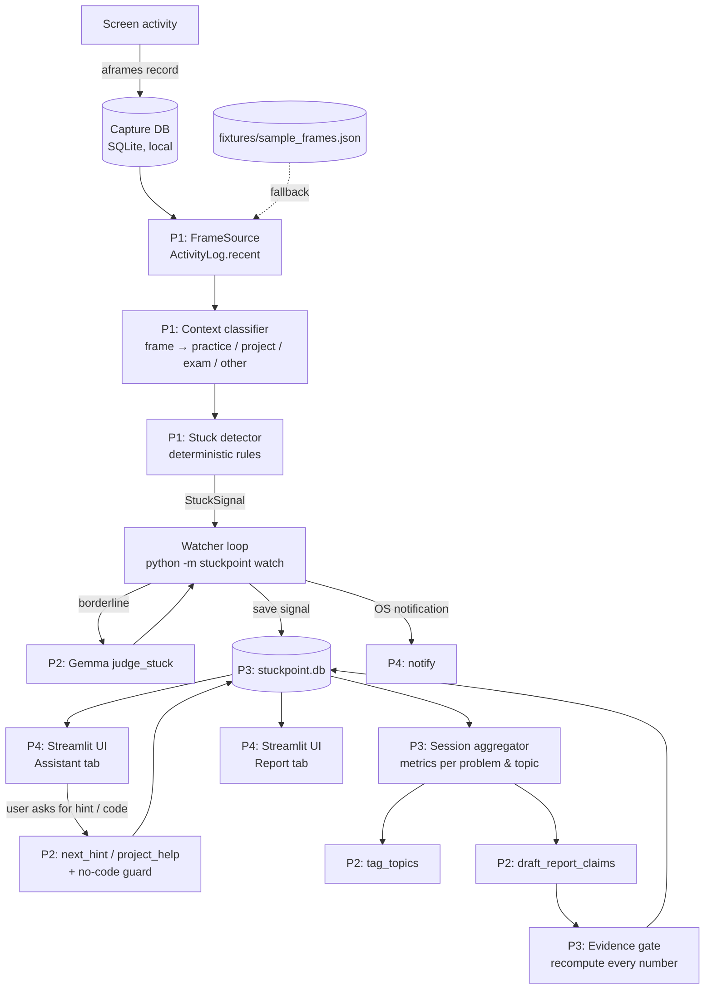

# StuckPoint — Team Build Instructions

> **⏰ Hard deadline: submission closes at 3:30 PM sharp. We start at 11:30 AM — that's 4 hours. Our own target is to submit by 3:15 PM.**
>
> Skim Part 1 together (5 minutes max). Then each person works from their own section in Part 4, following the clock times. The shared contracts in Part 3 are the most important thing in this file: if everyone codes to them, the four parts will plug together. Anything marked ✂️ is cut unless you're ahead of schedule.

---

## Contents

1. [Project overview](#part-1--project-overview)
2. [Architecture](#part-2--architecture)
3. [Shared contracts (everyone must follow)](#part-3--shared-contracts)
4. [Individual instructions](#part-4--individual-instructions)
   - [Person 1 — Capture, Context & Stuck Detection (Team Lead)](#person-1--capture-context--stuck-detection-team-lead)
   - [Person 2 — Gemma 4 Intelligence](#person-2--gemma-4-intelligence)
   - [Person 3 — Store, Sessions, Report & Evidence Gate](#person-3--store-sessions-report--evidence-gate)
   - [Person 4 — UI, Notifications, Demo & Submission](#person-4--ui-notifications-demo--submission)
5. [Timeline and integration checkpoints](#part-5--timeline-and-integration-checkpoints)
6. [Git workflow and hackathon rules](#part-6--git-workflow-and-hackathon-rules)
7. [Demo script](#part-7--demo-script)
8. [Risks and fallbacks](#part-8--risks-and-fallbacks)

---

## Part 1 — Project overview

### One line

**StuckPoint** is a privacy-first coding companion that works across every coding platform. It notices when you're stuck, offers help based on *where* you are (hints only on practice sites, full help on your own projects, off during exams), and builds an evidence-backed report of your strengths and weak spots.

### The problem

When students and developers get stuck, they either:

- **struggle alone too long**, looping between editor, errors, Stack Overflow and docs for 30–60 minutes, or
- **outsource the thinking**, pasting the problem into an AI chatbot, copying the answer and learning nothing.

Today's AI assistants live inside one editor, can't see that you've been bouncing between LeetCode, Google and ChatGPT for 25 minutes, and will happily write the full solution to a practice problem.

### What StuckPoint does

1. **Detects stuck moments** from behaviour on screen, on any platform, using [Activity Frames](https://github.com/nossa-y/activity-frames).
2. **Asks before helping:** "Looks like you've been on *Coin Change* for 22 minutes — want a hint?"
3. **Adapts help to context:**

   | Context | Examples | Help allowed |
   |---|---|---|
   | `practice` | LeetCode, HackerRank, Codeforces, course portals | Hints only, 3 levels. **Never code.** |
   | `project` | localhost, GitHub, editor on your own repo | Hint first; full code if the user asks |
   | `exam` | Proctored/exam domains | Assistant disabled |
   | `other` | Anything else | Nothing triggers |

4. **Builds a skills report:** strong topics, weak topics, time-to-unstuck, hints used, next problems to practise. Every number is verified against measured data by our **evidence gate**.

### Why this wins (say this in the pitch)

- **Cross-platform:** we watch behaviour, not one editor.
- **Context-aware policy:** the same assistant behaves differently on LeetCode and on your own project.
- **Evidence-gated AI:** *"Gemma can propose; only the measured data can prove."* Every claim in the report is recomputed from real activity before it is shown.
- **Privacy by design:** screen capture and episode compilation stay on the laptop. Only small text summaries (problem title, window titles, time and input counts, or code the user chooses to paste) are sent to Gemma 4. Never screenshots, and never the capture database.

### What each technology contributes

| Component | Its job | What it is NOT used for |
|---|---|---|
| **Activity Frames** (existing library, MIT) | Records screen activity locally and compiles it into measured episodes ("frames"): app, site, window titles, time, keystroke/click counts, evidence IDs | Interpretation. It never guesses intent |
| **Gemma 4** (via the Gemini API, model `gemma-4-31b-it`) | Judges borderline stuck cases, writes graduated hints, writes project-mode code, tags topics, drafts report claims | Counting or timing anything. Code does all measurement |
| **Our code** | Context policy, stuck rules, session aggregation, evidence gate, UI | — |

---

## Part 2 — Architecture

### Data flow



### Process model

There are only **two processes**, which keeps the build simple:

1. **Watcher** (`python -m stuckpoint watch`): a loop that runs every `CHECK_INTERVAL_S` seconds, pulls recent frames, classifies them, runs the stuck rules, asks Gemma about borderline cases, writes signals to the store, and fires an OS notification.
2. **UI** (`streamlit run stuckpoint/ui/app.py`): reads and writes the same SQLite store. It shows pending "want a hint?" prompts, calls the hint functions when the user clicks, and renders the report.

They communicate **only through the SQLite store** (`stuckpoint.db`). No servers, no sockets.

### Repository layout and ownership

```
stuckpoint/
├── README.md                    P4
├── instructions.md              (this file)
├── LICENSE                      P4 (MIT)
├── requirements.txt             P1 creates, everyone appends
├── .env.example                 P1
├── fixtures/
│   ├── sample_frames.json       P1  ← delivered in hour 1, unblocks everyone
│   └── sample_claims.json       P2  ← delivered in hour 2, unblocks P3
├── scripts/
│   └── seed_db.py               P1  (fallback capture DB)
├── stuckpoint/
│   ├── __init__.py
│   ├── __main__.py              P1  (CLI: watch / demo / report)
│   ├── config.py                P1
│   ├── models.py                ALL (agreed in hour 0, then frozen)
│   ├── capture/
│   │   └── source.py            P1
│   ├── context/
│   │   ├── sites.py             P1
│   │   └── classifier.py        P1
│   ├── detector/
│   │   └── stuck.py             P1
│   ├── watcher.py               P1
│   ├── llm/
│   │   ├── client.py            P2
│   │   ├── prompts/             P2  (*.md prompt templates)
│   │   ├── judge.py             P2
│   │   ├── hints.py             P2
│   │   ├── guard.py             P2
│   │   ├── topics.py            P2
│   │   └── report_draft.py      P2
│   ├── store/
│   │   └── db.py                P3
│   ├── report/
│   │   ├── aggregate.py         P3
│   │   ├── gate.py              P3
│   │   └── build.py             P3
│   └── ui/
│       ├── app.py               P4
│       └── notify.py            P4
└── tests/                       each person tests their own module
```

**Rule:** only edit files you own. If you need a change in someone else's file, tell them.

---

## Part 3 — Shared contracts

Agree on these **by 11:45**, put them in `stuckpoint/models.py`, and then don't change them without telling all four people.

### 3.1 Frames (input from Activity Frames — not ours)

`ActivityLog().recent(hours=1).to_dict()["frames"]` returns a list of dicts like:

```json
{
  "id": "f-0007",
  "app": "Google Chrome",
  "site": "leetcode.com",
  "start": "20:10:04",
  "end": "20:32:11",
  "duration_min": 21.4,
  "windows": ["Coin Change - LeetCode"],
  "pages": [{"kind": "page", "entity": "problems"}],
  "input": {"keys": 180, "clicks": 31},
  "interruptions": [{"app": "Slack", "seconds": 12}],
  "evidence": {"frame_ids": "99871..100147"}
}
```

Important facts about this data:
- `site`, `windows`, `pages`, `input` and `interruptions` may be **missing** when empty. Always use `.get()`.
- `start` and `end` are **local wall-clock times** (`HH:MM:SS`), not full timestamps.
- The full URL is **not** in the frame. LeetCode has no built-in parser, so `pages` shows only `{"kind": "page", "entity": "problems"}`. **Get the problem name from the window title** (see Person 1).
- Kinds we care about: `question` (Stack Overflow), `ai_chat` (ChatGPT/Claude), `local_dev` (localhost), `search`, `repo`, `code`, `pull_request`.
- No typed text and no code is included. That's by design.

### 3.2 Our models (`stuckpoint/models.py`)

```python
from dataclasses import dataclass, field
from typing import Literal, Optional

Mode = Literal["practice", "project", "exam", "other"]
Confidence = Literal["high", "medium", "speculative"]

@dataclass
class ContextLabel:
    mode: Mode
    platform: str                  # "leetcode", "hackerrank", "vscode", "localhost", ...
    problem_key: Optional[str]     # "leetcode:coin-change" | "project:<repo-or-window>" | None
    problem_title: Optional[str]   # "Coin Change"

@dataclass
class StuckSignal:
    id: str                        # "sig-<uuid8>"
    created_at: str                # ISO local time
    problem_key: str
    problem_title: Optional[str]
    mode: Mode
    platform: str
    minutes_on_problem: float      # measured, sum of duration_min
    loops: int                     # measured editor↔help cycles
    keys_per_min: float            # measured
    rules_fired: list[str]         # ["R1_time", "R2_loop", "R3_low_input"]
    frame_ids: list[str]           # ["f-0007", "f-0009", ...]
    needs_judgement: bool          # True → send to Gemma judge
    status: Literal["pending", "confirmed", "rejected", "offered",
                    "accepted", "dismissed", "snoozed"] = "pending"
    judge_reason: Optional[str] = None

@dataclass
class HintRequest:
    signal_id: str
    problem_key: str
    problem_title: Optional[str]
    mode: Mode
    level: int                     # 1 = nudge, 2 = concept, 3 = plain-language plan
    user_context: Optional[str] = None   # code/error the user pasted (optional)
    previous_hints: list[str] = field(default_factory=list)

@dataclass
class HintResponse:
    signal_id: str
    level: int
    text: str
    is_code: bool                  # True only for project-mode full code
    blocked: bool = False          # True if the guard blocked it
    block_reason: Optional[str] = None

@dataclass
class SessionRecord:               # one per problem attempt
    problem_key: str
    problem_title: Optional[str]
    platform: str
    mode: Mode
    topics: list[str]              # filled by P2's tag_topics
    first_seen: str
    last_seen: str
    active_min: float
    stuck_episodes: int
    hints_used: int
    max_hint_level: int
    time_to_unstuck_min: Optional[float]   # stuck signal → next frame on the problem with good input rate
    solved: Optional[bool]                 # set by the user in the UI ("Solved ✓")
    frame_ids: list[str]

@dataclass
class ReportClaim:
    id: str
    kind: Literal["strength", "weakness", "trend", "recommendation"]
    text: str                      # human sentence
    topic: Optional[str]
    numeric_claims: dict           # {"avg_active_min": 31.0, "problems": 4, ...}
    about_problems: list[str]      # problem_keys used as evidence
    confidence: Confidence
    gate_status: Literal["unchecked", "passed", "downgraded", "rejected"] = "unchecked"
    gate_reason: Optional[str] = None
    recomputed: dict = field(default_factory=dict)
```

### 3.3 Function interfaces (who provides, who calls)

| Function | Owner | Called by | Signature |
|---|---|---|---|
| `get_frames(minutes)` | P1 | watcher, P3 | `-> list[dict]` (from capture or fixture) |
| `classify(frame)` | P1 | P1, P3 | `dict -> ContextLabel` |
| `detect(frames, now)` | P1 | watcher | `-> list[StuckSignal]` |
| `gemma_json(prompt, schema)` | P2 | P2, P3 | `-> dict` (validated) |
| `judge_stuck(signal, frames)` | P2 | watcher | `-> (bool, reason)` |
| `next_hint(req)` | P2 | P4 | `HintRequest -> HintResponse` |
| `project_help(req)` | P2 | P4 | `HintRequest -> HintResponse` (may include code) |
| `tag_topics(title, platform)` | P2 | P3 | `-> list[str]` |
| `draft_report_claims(metrics)` | P2 | P3 | `-> list[ReportClaim]` |
| `Store` methods | P3 | everyone | see Person 3 |
| `build_sessions(frames, store)` | P3 | P3 | `-> list[SessionRecord]` |
| `run_gate(claims, metrics)` | P3 | P3 | `-> list[ReportClaim]` |
| `build_report()` | P3 | P4 | `-> dict` (metrics + gated claims) |
| `notify(title, body)` | P4 | watcher | `-> None` |

**Until a real function exists, the owner must commit a stub that returns realistic fake data with the right type.** This lets everyone integrate from hour 2.

### 3.4 Topic vocabulary (shared)

Use only these topic strings so the report groups cleanly:

```
arrays, strings, hashing, two-pointers, sliding-window, stack-queue, linked-list,
binary-search, sorting, recursion, backtracking, trees, graphs, heaps,
dynamic-programming, greedy, math, bit-manipulation,
debugging, environment-setup, http-apis, cors, async, databases, git, other
```

### 3.5 Configuration (`.env`)

```env
GEMINI_API_KEY=                        # from aistudio.google.com/apikey — never commit this
GEMMA_MODEL=gemma-4-31b-it             # fallback: gemma-4-26b-a4b-it (faster)
AFRAMES_DB=                            # optional: path to a capture DB
STUCKPOINT_SOURCE=live                 # live | fixture
STUCKPOINT_FIXTURE=fixtures/sample_frames.json
STUCKPOINT_DB=stuckpoint.db
STUCK_THRESHOLD_MIN=15
CHECK_INTERVAL_S=60
COOLDOWN_MIN=10
```

For the live demo, set `STUCK_THRESHOLD_MIN=3` so the prompt appears quickly.

---

## Part 4 — Individual instructions

---

### Person 1 — Capture, Context & Stuck Detection (Team Lead)

**Mission:** turn raw screen activity into reliable `StuckSignal`s, and keep the team unblocked with fixtures and the main loop.

**You own:** `capture/source.py`, `context/`, `detector/stuck.py`, `watcher.py`, `__main__.py`, `config.py`, `scripts/seed_db.py`, `fixtures/sample_frames.json`, `requirements.txt`, `.env.example`. As Team Lead you also own the OrganizerHQ submission.

**Machine:** you should be on the Mac. Activity Frames' recorder is best tested on macOS (Apple Silicon).

#### Step-by-step

**11:30–11:45 — set up (with everyone)**
1. Create the GitHub repo (public, MIT license), add all three teammates, push the folder skeleton from Part 2.
2. Write `models.py` with the team from Part 3.2 and commit it.
3. `pip install activity-frames` and run `aframes record`. Grant screen-recording and accessibility permissions.
4. Write `config.py`: read the `.env` values from Part 3.5 with defaults.

**11:45–12:15 — real data + fixture (top priority: this unblocks everyone)**
1. Spend 10 minutes on LeetCode, VS Code, Stack Overflow, ChatGPT and localhost while recording.
2. Run `aframes context --hours 1` and `aframes today -f json`. Look at the real `windows` titles for LeetCode, HackerRank, VS Code and localhost, and note their exact format.
3. Save a cleaned sample to `fixtures/sample_frames.json`: about 30–60 frames covering at least one "stuck on a LeetCode problem" stretch and one project stretch.
4. Write `capture/source.py`:

   ```python
   def get_frames(minutes: int = 60) -> list[dict]:
       if config.SOURCE == "fixture":
           return json.load(open(config.FIXTURE))["frames"]
       from activity_frames import ActivityLog
       log = ActivityLog(config.AFRAMES_DB or None, min_minutes=0)
       try:
           return log.recent(hours=minutes / 60).to_dict()["frames"]
       finally:
           log.close()
   ```

   Use `min_minutes=0`; the default of 0.5 drops short frames, and we need them for loop detection.

5. **Commit and tell the team the fixture is ready.**

**12:15–12:45 — context classifier**
1. In `context/sites.py`, write the policy table:

   ```python
   PRACTICE = {"leetcode.com": "leetcode", "hackerrank.com": "hackerrank",
               "codeforces.com": "codeforces", "geeksforgeeks.org": "gfg"}
   EXAM = {"<proctoring domains you choose>"}
   PROJECT_APPS = {"Code", "Visual Studio Code", "Cursor", "PyCharm", "Terminal", "iTerm2"}
   HELP_KINDS = {"question", "ai_chat", "search"}   # "looking for help" frames
   ```

2. In `context/classifier.py`, write `classify(frame) -> ContextLabel`:
   - `site` in `PRACTICE` → `mode="practice"`. Get the title from `windows[0]` by stripping the platform suffix: `"Coin Change - LeetCode"` → `"Coin Change"`. Then `problem_key = "leetcode:coin-change"`.
   - `site` in `EXAM` → `mode="exam"`.
   - Editor app, or `pages` kind `local_dev` / `repo` / `code` → `mode="project"`. `problem_key = "project:" + <file or repo name from the window title>`.
   - Otherwise → `mode="other"`, `problem_key=None`.
3. ✂️ Optional improvement: register a LeetCode URL parser at runtime so `pages` carries the slug:

   ```python
   from activity_frames import entities
   entities._SITE_PARSERS["leetcode.com"] = my_leetcode_parser  # private API; keep the title fallback
   ```

4. Write `tests/test_classifier.py` using the fixture.

**12:45–1:30 — stuck detector** (start with `R1_time` + `R2_loop`; add `R3_low_input` only if time allows)

Write `detect(frames, now) -> list[StuckSignal]` in `detector/stuck.py`. Look at the last 30 minutes only. Group frames by the most recent `problem_key` the user was working on: help-seeking frames in between (Stack Overflow, ChatGPT, search) belong to the problem they interrupted.

| Rule | Fires when | Default |
|---|---|---|
| `R1_time` | Active minutes on one problem ≥ `STUCK_THRESHOLD_MIN` | 15 min |
| `R2_loop` | ≥ 3 cycles of *problem frame → help frame → problem frame* within 20 min | 3 loops |
| `R3_low_input` | On the problem ≥ 10 min and `keys / active_min` < 8 | 8 keys/min |

Decision:
- `R1` + (`R2` or `R3`) → signal with `needs_judgement=False` (confident).
- Exactly one rule → signal with `needs_judgement=True` (Gemma decides).
- `mode == "exam"` or `"other"` → never emit.
- **Cooldown:** no new signal for the same `problem_key` within `COOLDOWN_MIN` of the last one, or while it's snoozed. Check `store.last_signal_for(problem_key)`.

Fill every measured field (`minutes_on_problem`, `loops`, `keys_per_min`, `frame_ids`). These are what the evidence gate trusts later.

Write `tests/test_stuck.py` with three hand-made frame lists: clearly stuck, clearly fine, borderline.

**1:30–2:15 — watcher and CLI**

`watcher.py`:

```python
while True:
    frames = get_frames(60)
    for sig in detect(frames, now()):
        if sig.needs_judgement:
            ok, reason = judge_stuck(sig, frames)         # P2
            sig.status = "confirmed" if ok else "rejected"
            sig.judge_reason = reason
        else:
            sig.status = "confirmed"
        store.save_signal(sig)                            # P3
        if sig.status == "confirmed":
            notify("StuckPoint", f"Stuck on {sig.problem_title}? Open StuckPoint for a hint.")  # P4
    store.save_frames(frames)                             # P3 keeps frames for the report
    sleep(config.CHECK_INTERVAL_S)
```

`__main__.py` commands:
- `python -m stuckpoint watch` — the loop above.
- `python -m stuckpoint demo` — runs one detection pass on the fixture and prints the signals (for judges without a Mac).
- `python -m stuckpoint report` — calls P3's `build_report()` and prints JSON.

**2:15–2:30 — tuning, then freeze**
1. Set `STUCK_THRESHOLD_MIN=3` in the demo `.env` and confirm the prompt fires within a few minutes of a staged stuck session.
2. If live capture is broken, switch the demo to `STUCKPOINT_SOURCE=fixture`. ✂️ `scripts/seed_db.py` is cut — fixture mode is the fallback.

**3:00–3:15 — submit** in OrganizerHQ with P4's links. Select the Gemma 4 challenge. Don't wait until 3:29.

#### Definition of done
- [ ] `fixtures/sample_frames.json` committed by 12:15
- [ ] `classify()` correctly labels LeetCode, VS Code, localhost, Stack Overflow and ChatGPT frames in the fixture
- [ ] `detect()` passes the three test cases
- [ ] `python -m stuckpoint watch` runs for 10 minutes without crashing and produces a signal on a real stuck session
- [ ] `python -m stuckpoint demo` works with no Mac and no capture
- [ ] Submission done in OrganizerHQ by 3:15 PM (Gemma 4 challenge selected)

---

### Person 2 — Gemma 4 Intelligence

**Mission:** every model call goes through you. Make Gemma's output structured, safe and useful, and make it impossible for practice-mode hints to contain code.

**You own:** everything in `stuckpoint/llm/` and `fixtures/sample_claims.json`.

**Machine:** any laptop. Gemma 4 runs through Google's Gemini API, so no GPU or model download is needed.

#### Step-by-step

**11:30–11:45 — API working**
1. Create a key at [aistudio.google.com/apikey](https://aistudio.google.com/apikey). Share it with the team privately (not in git). Put it in each person's local `.env` as `GEMINI_API_KEY`.
2. `pip install google-genai python-dotenv jsonschema`.
3. Smoke test:

   ```python
   from google import genai
   client = genai.Client()   # reads GEMINI_API_KEY
   print(client.models.generate_content(model="gemma-4-31b-it", contents="Say hi").text)
   ```

4. Check the rate limits for your key in AI Studio. If they're tight, ask a second teammate to create a backup key now, not at 2:45.
5. If `gemma-4-31b-it` is slow (over about 10 s per hint), switch `GEMMA_MODEL` to `gemma-4-26b-a4b-it`.

**11:45–12:05 — client**

`llm/client.py`:

```python
def gemma_json(prompt: str, schema: dict, *, system: str = "", retries: int = 1) -> dict:
    """Call Gemma 4 via the Gemini API, ask for JSON, validate, retry once."""
```

- Use `client.models.generate_content(model=config.GEMMA_MODEL, contents=prompt, config=types.GenerateContentConfig(system_instruction=system, temperature=..., response_mime_type="application/json"))` (`from google.genai import types`).
- Also try passing `response_schema=schema`. If the API rejects it for Gemma, drop it and instead **paste the schema into the prompt** ("Reply with JSON matching this schema: …"). Either way, always validate locally.
- If the reply has text around the JSON, strip it to the first `{` … last `}` before parsing.
- Wrap calls in a 20 s timeout and catch API errors (rate limit, network). On failure return a safe default; never crash the watcher or UI.
- **Cache** results by input hash (`functools.lru_cache` or a dict). The same topic tag or judgement should never be requested twice.
- Validate the result against the schema (`jsonschema` package). On failure, retry once with the error appended to the prompt. If it still fails, raise a clear exception; callers fall back gracefully.
- Set `temperature` low (0.2) for judging and tagging, and moderate (0.5) for hints.
- Log every prompt and response to `logs/llm.jsonl`. You'll want this when debugging and for the demo.

**12:05–12:15 — stub everything first.** Commit stub versions of `judge_stuck`, `next_hint`, `project_help`, `tag_topics` and `draft_report_claims` that return realistic fake values. Also commit `fixtures/sample_claims.json` (5–6 `ReportClaim`s, including one with a deliberately wrong number). Tell P3 and P4.

**12:15–12:45 — `judge_stuck(signal, frames) -> (bool, str)`**

Prompt input: the problem title, mode, measured fields (`minutes_on_problem`, `loops`, `keys_per_min`, `rules_fired`) and a compact list of the relevant frames (app, site, window title, duration, keys). Never send more than about 40 frames.

Schema:

```json
{"type": "object",
 "properties": {"stuck": {"type": "boolean"},
                "reason": {"type": "string", "maxLength": 200}},
 "required": ["stuck", "reason"]}
```

Instruction gist: *"Decide whether this person is genuinely stuck or productively working. Long time alone is not enough; look for loops between the problem and help sources, and low typing. Answer only from the data given."*

**12:45–1:45 — hints (the core of the demo)**

`next_hint(req)`, practice mode, levels:

| Level | Name | What it gives | Example (Coin Change) |
|---|---|---|---|
| 1 | Nudge | A guiding question | "What's the fewest coins needed for a smaller amount? Could that help?" |
| 2 | Concept | Names the technique and why it fits | "This is dynamic programming: the best answer for amount *a* builds on answers for *a − coin*." |
| 3 | Plan | Numbered plain-English steps, **no code or code-like syntax** | "1. Make a table of size amount+1… 2. …" |

Schema: `{"text": string, "level": integer}`. Include `previous_hints` in the prompt so the next level doesn't repeat itself.

`guard.py` — `check_no_code(text) -> (ok: bool, reason)`. Block if the text contains any of:
- code fences (`` ``` ``) or inline code longer than about 20 characters
- lines matching common code shapes: `def `, `return `, `class `, `for (`, `while (`, `=>`, `{` … `}`, `;` at line end, `int[]`, `vector<`, `dp[` with assignment
- more than 2 lines starting with 4+ spaces

If blocked in practice mode: regenerate once with a stricter instruction. If still blocked, return `HintResponse(blocked=True, block_reason=...)` with a safe generic hint. **Practice mode must never return code, even if the user asks.** The UI shows "Code isn't available on practice sites — here's the next hint instead."

`project_help(req)`, project mode only:
- `level` 1–2 behave like hints, but code snippets are allowed.
- If the user explicitly requests full code (P4 sends `level=4`), return a complete solution using `user_context` (pasted code/error). Set `is_code=True`.
- Assert `req.mode == "project"`. Raise if called in any other mode.

**1:45–2:00 — `tag_topics(title, platform) -> list[str]`**
- Return 1–3 topics, **only from the shared vocabulary** (Part 3.4). Use an `enum` in the schema.
- Cache results by `problem_key` in a dict or the store, since the same problem is tagged many times.

**2:00–2:30 — `draft_report_claims(metrics) -> list[ReportClaim]`**

P3 gives you a metrics dict such as:

```json
{"topics": {"dynamic-programming": {"problems": 4, "avg_active_min": 31.0,
            "stuck_episodes": 5, "hints_used": 7, "solved": 2,
            "problem_keys": ["leetcode:coin-change", "..."]},
            "arrays": {"...": "..."}},
 "overall": {"problems": 11, "total_active_min": 214.5}}
```

Ask Gemma to produce 4–8 claims (strengths, weaknesses, one trend if possible, 2–3 recommendations). **Hard rule in the prompt:** every number in `text` must also appear in `numeric_claims` under the **same key name** as in `metrics`, and `about_problems` must list the problem keys used. That's what makes the gate possible. Set `confidence` honestly: fewer than 2 problems in a topic means `"speculative"`.

#### Definition of done
- [ ] All five functions callable with real Gemma output; average latency per hint under about 10 s
- [ ] API failures (no network, rate limit) degrade gracefully with a safe message instead of a crash
- [ ] No API key anywhere in git (`git log -p | grep -i AIza` returns nothing)
- [ ] The guard blocks code in 10/10 adversarial tests (e.g. "just give me the code", "write it in Python")
- [ ] `tag_topics` only ever returns vocabulary topics
- [ ] `draft_report_claims` output passes P3's gate on real data at least most of the time
- [ ] `logs/llm.jsonl` shows every call
- [ ] A short "Where Gemma 4 is used" section handed to P4 for the README (needed for the Gemma challenge)

---

### Person 3 — Store, Sessions, Report & Evidence Gate

**Mission:** own the data. Everything is saved in your store, you turn activity into per-problem sessions and metrics, and you build the **evidence gate**, our core innovation.

**You own:** `store/db.py`, `report/aggregate.py`, `report/gate.py`, `report/build.py` and their tests.

#### Step-by-step

**11:30–12:15 — store (`store/db.py`)**

SQLite file at `config.STUCKPOINT_DB`. Use `sqlite3` from the standard library and store dataclasses as JSON columns where convenient.

| Table | Key columns |
|---|---|
| `frames` | `id` (frame id + date, so ids from different runs don't clash), `json`, `seen_at` |
| `signals` | `id`, `problem_key`, `status`, `created_at`, `json` |
| `hints` | `id`, `signal_id`, `level`, `is_code`, `blocked`, `text`, `created_at` |
| `sessions` | `problem_key`, `json`, `updated_at` |
| `claims` | `id`, `json`, `gate_status`, `created_at` |
| `user_marks` | `problem_key`, `solved` (bool), `marked_at` |

`Store` methods everyone uses:

```python
save_frames(frames)            ; all_frames() -> list[dict]
save_signal(sig)               ; pending_signals() -> list[StuckSignal]
update_signal_status(id, s)    ; last_signal_for(problem_key) -> StuckSignal | None
save_hint(resp)                ; hints_for(signal_id) -> list[HintResponse]
mark_solved(problem_key, bool)
save_sessions(list)            ; sessions() -> list[SessionRecord]
save_claims(list)              ; claims() -> list[ReportClaim]
```

Use `PRAGMA journal_mode=WAL` because the watcher and UI write at the same time. **Commit a working store by 12:15.** P1 and P4 depend on it.

**12:15–1:15 — sessions and metrics (`report/aggregate.py`)**

1. `build_sessions(frames, store) -> list[SessionRecord]`
   - Run P1's `classify()` on each frame and group frames by `problem_key` (practice and project only).
   - `active_min` = sum of `duration_min`.
   - `stuck_episodes` = confirmed signals for that problem; `hints_used` / `max_hint_level` from the `hints` table.
   - `time_to_unstuck_min` = minutes from the first accepted hint to the next frame on that problem with `keys/min ≥ 15`. Leave it `None` if that never happens. Document this definition in the README; judges like seeing it written down.
   - `solved` from `user_marks` (the user clicks "Solved ✓" in the UI). **We never guess whether something was solved.**
   - `topics` from P2's `tag_topics`.
2. `compute_metrics(sessions) -> dict`, shaped exactly as in Person 2's section (per-topic and overall). This dict is the **single source of truth** for numbers.

**1:15–2:15 — evidence gate (`report/gate.py`)** ⭐ (checks 1, 2 and 4 are must-haves; check 3 is ✂️ if short on time)

`run_gate(claims, metrics, sessions) -> list[ReportClaim]`. For every claim:

1. **Number check.** For each key in `numeric_claims`, look up the same key in `metrics["topics"][claim.topic]` (or `metrics["overall"]` if `topic` is `None`). Use a tolerance of ±0.5 for minutes and an exact match for counts. Store what you found in `recomputed`.
2. **Evidence check.** Every entry in `about_problems` must exist in `sessions`, and its topics must include `claim.topic`.
3. **Text check.** Extract every number from `claim.text` with a regex. Each must appear in `numeric_claims` (± rounding). This catches numbers Gemma slips into the sentence only.
4. **Sufficiency check.** If the topic has fewer than 2 problems, cap confidence at `speculative`.

Outcome:
- Every check passes → `passed`.
- Only the sufficiency cap applied → `downgraded`, with the reason.
- Any number or evidence mismatch → `rejected`, with a precise reason such as `"avg_active_min claimed 25.0, measured 31.0"` or `"cites leetcode:two-sum, not in sessions"`.

Write `tests/test_gate.py` using P2's `fixtures/sample_claims.json`. The deliberately wrong claim must be rejected.

**2:15–2:30 — `report/build.py`**

```python
def build_report() -> dict:
    frames   = store.all_frames()
    sessions = build_sessions(frames, store)
    metrics  = compute_metrics(sessions)
    claims   = run_gate(draft_report_claims(metrics), metrics, sessions)   # P2 drafts
    store.save_sessions(sessions); store.save_claims(claims)
    return {"metrics": metrics, "sessions": sessions, "claims": claims,
            "gate_summary": {"passed": n1, "downgraded": n2, "rejected": n3}}
```

`gate_summary` is the headline number for the demo: *"Gemma made 8 claims: 6 passed, 1 downgraded, 1 rejected."*

#### Definition of done
- [ ] Store works with two processes writing at once
- [ ] Sessions and metrics correct on the fixture (check two by hand)
- [ ] The gate rejects the planted wrong claim and explains why
- [ ] `python -m stuckpoint report` prints a full report with `gate_summary`
- [ ] Metric definitions (3–4 lines) sent to P4 for the README by 2:40 (✂️ no separate `docs/metrics.md`)

---

### Person 4 — UI, Notifications, Demo & Submission

**Mission:** make it usable and make it win. You own everything the judges see: the app, the demo, the README, the video and the pitch.

**You own:** `ui/app.py`, `ui/notify.py`, `README.md`, `LICENSE`, demo script, slides, demo video, Devpost page.

#### Step-by-step

**11:30–11:45 — set up**
1. Copy the prepared README into the repo and fill in the team names.
2. Add the MIT `LICENSE`.
3. `pip install streamlit streamlit-autorefresh plyer`. Get a "hello" Streamlit app running.

**11:45–12:05 — notifications (`ui/notify.py`)**

```python
def notify(title: str, body: str) -> None:
    # macOS: osascript display notification; others: plyer.notification.notify
    # never raise — wrap everything in try/except
```

Test it on the Mac. Commit early; P1's watcher calls it.

**12:05–1:30 — Assistant tab (`ui/app.py`)**

Use `st_autorefresh(interval=5000)` so new prompts appear without clicking.

For each `store.pending_signals()` with status `confirmed` or `offered`, show a card:

> **Stuck on Coin Change?** · LeetCode · practice mode
> 22 min on this problem · 3 trips to Stack Overflow/ChatGPT · low typing
> [ Give me a hint ] [ Not now (snooze 15 min) ] [ I'm fine ]

The measured line comes straight from the signal's fields. Show it, because it explains *why* we asked.

When the user clicks **Give me a hint**:
- Build a `HintRequest` (level = number of previous hints + 1, max 3) and call P2's `next_hint`.
- Show the hint, then offer **[ Next hint ]** and **[ Solved ✓ ]**.
- In **practice mode**, show a disabled **[ Show code ]** button with the tooltip "Code isn't available on practice sites."
- In **project mode**, show a text box "Paste your code or error (optional)" and buttons **[ Hint ]** and **[ Full solution ]**. Full solution calls `project_help` with `level=4`; render the code with `st.code`.
- Update statuses with `store.update_signal_status`: `accepted`, `snoozed`, `dismissed`.
- Show a small mode badge everywhere (🟢 practice / 🔵 project / ⛔ exam) so the policy is visible in the demo.

**1:30–2:30 — Report tab** (items 1–4 are must-haves; the chart in item 5 is ✂️ if short on time)

Call P3's `build_report()` with a **[ Refresh report ]** button (it calls Gemma, so don't run it on every refresh).

Layout:
1. **Headline row:** problems attempted · total active minutes · stuck episodes · hints used.
2. **Gate summary:** "8 claims · 6 verified ✓ · 1 low-confidence ⚠ · 1 rejected ✗". This is the innovation; make it prominent.
3. **Strengths / Needs improvement / Recommendations:** each claim as a card with a ✓ / ⚠ / ✗ badge. A rejected claim is shown struck-through with its `gate_reason`. Showing rejections openly is the point.
4. **"Show evidence"** expander under each claim: the problems and frame IDs it relies on.
5. **Per-topic chart:** average active minutes per topic, from `metrics`. Use a simple bar chart.

**Demo, README and submission (runs alongside the UI work)**
- **12:15:** agree the exact LeetCode problem for the demo with P1. Pick one with a known, hintable approach, like Coin Change.
- **12:30:** remind every teammate to spend some real time on practice problems while capture runs (e.g. while testing). That's the report's data. Keep a note of it to disclose. If there isn't enough, the report runs on the fixture.
- **2:30–2:50:** finalise the README: team table, contributions, "Implementation During the Hackathon" checklist (tick only what actually works), setup steps, Gemma usage section from P2, metric definitions from P3.
- **2:50–3:00:** record a 2–3 minute screen recording of the working flow as the demo video. Upload it and add the link.
- **3:00:** hand P1 the repo link, video link and Devpost link for submission.
- ✂️ Slides are cut. The live app and README architecture diagram are the presentation. Make 2 slides only if you're ahead.

#### Definition of done
- [ ] A user can go from notification → hint 1 → hint 2 → hint 3 → "Solved ✓" without touching code
- [ ] Practice mode never shows a code path; project mode can show full code
- [ ] Report tab shows gate summary, claim badges, evidence expanders and the topic chart
- [ ] README complete and setup tested
- [ ] Demo video recorded and linked by 3:00

---

## Part 5 — Timeline and integration checkpoints

**Today: 11:30 AM → 3:30 PM sharp (4 hours). We submit by 3:15 PM.** Eat at your desk; there's no lunch break in this plan.

| Time | P1 Capture/Detect | P2 Gemma | P3 Store/Report/Gate | P4 UI/Demo |
|---|---|---|---|---|
| **11:30–11:45** | Repo, skeleton, `models.py`, `.gitignore`, recorder running | API key + smoke test, share key privately | Read contracts, plan tables | README/LICENSE in repo, Streamlit hello |
| **11:45–12:15** | Record 10 min → **fixture committed** | `gemma_json` client → **stubs + sample_claims committed** | **Store committed** | `notify()`, Assistant tab skeleton on stubs |
| **12:15** | **🔗 Checkpoint 1 (5 min):** fixture → classify (stub) → store → UI shows a fake card. Decide: live capture or fixture mode? | | | |
| **12:15–1:30** | Classifier, then stuck rules R1 + R2 | `judge_stuck`, then hints + no-code guard | Sessions + metrics | Hint flow end-to-end (practice mode) |
| **1:30** | **🔗 Checkpoint 2 (5 min):** real signal → notification → real Gemma hint in the UI. **This is the minimum demo — protect it.** | | | |
| **1:30–2:30** | Watcher loop + CLI, threshold tuning | `tag_topics`, `draft_report_claims`, project help | **Evidence gate**, `build_report` | Report tab (gate summary, claim cards, evidence) |
| **2:30** | **🔗 Checkpoint 3 + 🧊 FEATURE FREEZE.** Full flow incl. report. Bug fixes only after this | | | |
| **2:30–3:00** | Rehearse demo ×2 with P4 | Latency + rate-limit check, Gemma section for README | Check 2 numbers by hand, metric definitions for README | README final, record demo video (2:50) |
| **3:00–3:15** | **SUBMIT in OrganizerHQ** (select Gemma 4 challenge) | Verify repo is public and runs | Verify README setup steps | Devpost page, links |
| **3:15–3:30** | Buffer. Fix only submission problems. **Nothing new.** | | | |

**Commits:** 4 hours means at least 4 commits each to meet the 1-per-hour rule. Aim for one every 20–30 minutes.

### ✂️ Scope for a 4-hour build

| Must have (the demo) | Should have (if on time at 1:30) | Cut |
|---|---|---|
| Fixture + live/fixture source | `judge_stuck` for borderline cases | `scripts/seed_db.py` |
| Classifier (practice / project / exam) | Project-mode full code | LeetCode runtime URL parser |
| Stuck rules R1 + R2 | R3 low-input rule | Gate check 3 (numbers inside text) |
| Graduated hints + no-code guard | Topic chart in Report tab | `docs/metrics.md` |
| Assistant tab with hint flow | Snooze / cooldown polish | Slides |
| Report with evidence gate (checks 1, 2, 4) | | |
| README + demo video + submission | | |

If you are behind at **1:30**, drop everything in "Should have" and finish the must-haves. If you're behind at **2:30**, freeze anyway and demo what works.

At each checkpoint all four meet for 5 minutes: run it, list what's broken, reassign if someone is blocked.

---

## Part 6 — Git workflow and hackathon rules

**Rules from the competition deck that affect us:**
- The project must be **built during the Hack Day**. Only install tools beforehand; write no project code before the start.
- **At least 1 commit per hour per teammate** is considered during shortlisting. Commit small and often.
- Libraries, models and APIs are allowed (Activity Frames, Gemma 4 via the Gemini API, Streamlit). Credit them in the README.
- Public repo with a clear open-source license, plus a README with project, setup, dependencies and usage.
- Submit through MLH / OrganizerHQ before the window closes, and **select the Gemma 4 challenge** when submitting.

**Git workflow:**
- Branches: `p1/<thing>`, `p2/<thing>`, `p3/<thing>`, `p4/<thing>`.
- Merge to `main` at least every 1–2 hours via short PRs. The owner merges; no long-lived branches.
- Commit message style: `detector: add R2 loop rule`, `llm: practice-mode guard`, `gate: reject unknown problem keys`.
- Never commit `.env` (it holds the API key), capture databases, `stuckpoint.db` or `logs/`. Add them to `.gitignore` in hour 0.
- `main` must always run. If you break it, fixing it is everyone's first priority.

---

## Part 7 — Demo script

**Total: about 4 minutes.** P4 presents; P1 drives the laptop.

| Time | What happens | What we say |
|---|---|---|
| 0:00–0:30 | Slide: the two failure modes | "When you're stuck, you either struggle for an hour or paste it into ChatGPT and learn nothing. Existing assistants live in one editor and will solve your practice problem for you." |
| 0:30–1:30 | Live: work on Coin Change on LeetCode, bounce to Stack Overflow and back. Notification appears (threshold set to 3 min) | "StuckPoint watches behaviour across any platform. Capture stays on this laptop. No AI yet, just measurement: 4 minutes, 2 trips to help sites, low typing." |
| 1:30–2:15 | Click hint → level 1 → level 2. Type "just give me the code" | "Gemma 4 gives graduated hints from a short text summary, never a screenshot. On practice sites, code is never allowed, even when you ask." |
| 2:15–2:45 | Switch to the VS Code project with a CORS error. Paste the error, click Full solution | "Same tool, different context: on your own project it gives full help." |
| 2:45–3:30 | Report tab on the team's day of data | "Here's the skills report. Gemma made 8 claims; our evidence gate recomputed every number from the measured activity: 6 verified, 1 low-confidence, 1 rejected. Here's why it was rejected." |
| 3:30–4:00 | Slide: architecture + impact | "Activity Frames measures. Gemma 4 interprets. The gate proves." |

**Rehearse twice.** Have the backup video open in a browser tab.

---

## Part 8 — Risks and fallbacks

| Risk | Fallback | Owner |
|---|---|---|
| Recorder won't run or lacks permissions | `STUCKPOINT_SOURCE=fixture` — decide by 12:15, don't sink time into it | P1 |
| No Mac on the team | Linux x64 build exists but is less tested; otherwise fixture mode for the whole demo, and say so | P1 |
| Running out of time | Follow the ✂️ cut list in Part 5; freeze at 2:30 no matter what | Everyone |
| Gemma API slow | Switch to `gemma-4-26b-a4b-it`; cap prompt to 40 frames; show a spinner | P2 |
| Rate limit hit during demo | Backup API key ready; cache responses; don't call Gemma on every UI refresh | P2 |
| Venue Wi-Fi fails | Phone hotspot ready; backup demo video | P4 |
| Gemma returns invalid JSON | Schema-constrained output + validate + 1 retry + safe default | P2 |
| A hint leaks code on a practice site | Guard + regenerate + generic safe hint | P2 |
| Stuck detector never fires in the live demo | `STUCK_THRESHOLD_MIN=3` for the demo; a "Check now" debug button in the UI | P1 / P4 |
| Report has too little data | Everyone records real practice through the day; fixture-based report as backup | P4 / P3 |
| Gate rejects everything | Tighten P2's prompt rule (same key names); show the result honestly | P2 / P3 |
| Live demo fails on stage | Switch to the backup video immediately | P4 |
| A judge asks "isn't this surveillance?" | "It's yours: opt-in, capture stays on your machine, only short text summaries go to the model, never screenshots, and it's off during exams." | Everyone |

---

*Keep this file in the repo. If a contract in Part 3 changes, update it here first, then tell the team.*
